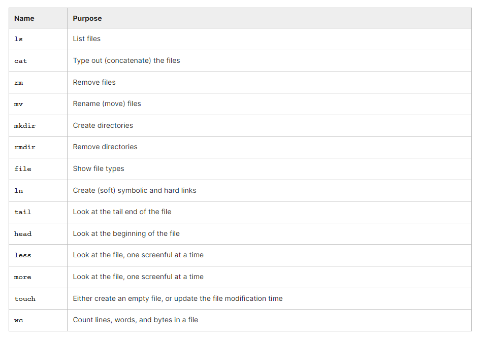
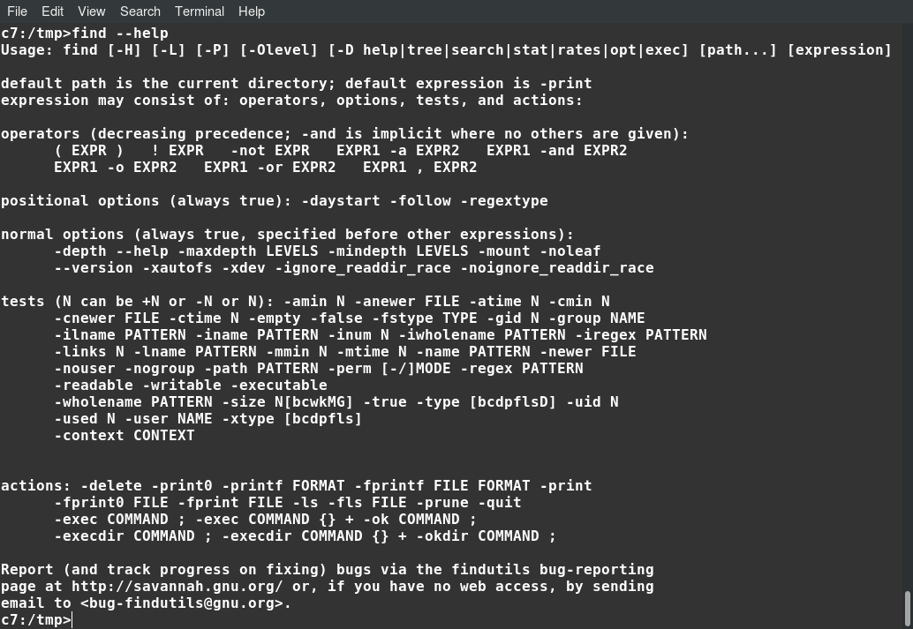

# Chapter 1: Essential Command line tools

- Know the basic utility programs for listing, creating, renaming files and other basic file operations.
- Use the find program to locate files satisfying certain characteristics.​
- Know how to use the locate command to find files with specified names.
- Use grep to identify lines in files which contain certain strings.
- Use sed to edit files in a streaming fashion.

## Table of Contents
<div id="user-content-toc">
  <ul>
    <li><a href="#listing-creating-deleting-and-renaming-files-and-directories">Listing, Creating, Deleting and Renaming Files and Directories</a></li>
    <li><a href="#finding-files-find">Finding Files: find</a></li>
    <li><a href="#finding-files-grep">Finding Files: grep</a></li>
    <li><a href="#string-substitution-sed">String Substitution: sed</a></li>
  </ul>
</div>


## Listing, Creating, Deleting and Renaming Files and Directories



## Finding Files: find

The find command line utility provides an extremely powerful and flexible method for locating files based on their properties, including name. **_find_ command does not search the interior of files for patterns, etc.** That is more the province of grep and its variations

```
$ find [location] [criteria] [actions]
```

- There are three classes of arguments, each/all of which may be omitted. 
- If no location is given, the current directory (.) is assumed. 
- If no criteria are given, all files are displayed. 
- If no actions are given, only a listing of the names is shown.

```$ find /etc -name "*.conf"``` : Print out the names of all files in the /etc directory and its descendants, recursively, that end in .conf.

```$ find /etc -name "*.conf" -ls``` : Print out a long listing, not just the names.

```$ find /tmp /etc -name "*.conf" -or -newer /tmp/.X0-lock -ls``` : look in subdirectories under /etc and /tmp for files that are either ending in .conf or are newer than /tmp/.X0-lock, and print out a long listing.


All of the below 3 commands do the same:
- ```$ find . -name "*~" -exec rm {} ';'``` : {} is a fill in for the files to be operated on, and ';' indicates the end of the command.
- ```$ find . -name "*~" | xargs rm```: accomplish the same action as above
- ```$ for names in $(find . -name "*~" ) ; do rm $names ; done```: accomplish the same action as above

**Note: If a filename has a blank space in it (or some other special characters), some of the previous commands will fail.**

```$ find . -name "*~" -print0 | xargs -0 rm``` : This will work even if files has space or some other special characters.

It is generally a disfavored practice to utilize such file names in UNIX-like operating systems, but it is not uncommon for such files to exist, either in files brought in from other systems or from applications which are also used in other systems.

**​There are many options to find especially as regarding selection of files to display. This can be done based on size, time of creation or access, type of file, owner, etc.**

A quick synopsis can be provided by find --help:



## Finding Files: grep

grep (stands for global regular expression print), is a workhorse command line utility whose basic job is to **search files for patterns and print out matches according to specified options**. grep can work with more complicated regular expressions which can contain wildcards and other special attributes.

```
$ grep pig file

pig
dirty pig
pig food
```

```$ grep -i -e pig -e dog -r .``` : search all files in the current directory and those below it for the strings pig or dog, ignoring case.

```$ grep "^dog" file ``` : print all lines that start with "dog"

```$ grep "dog$" file ``` : print all lines that end with "dog"

```$ grep d[a-p] file ``` : print all lines with a d followed by a character from a to p


## String Substitution: sed

sed (stream editor) is to **make substitutions and other modifications in files and in streamed output**.

Any of the following methods will change all first instances of the string pig with cow for each line of file and put the results in newfile:
```
$ sed s/pig/cow/ file > newfile
$ sed s/pig/cow/ < file > newfile
$ cat file | sed s/pig/cow/ > newfile
```
where the s stands for substitute. If you want to change all instances, you have to add the g (global) qualifier like ```$ sed s/pig/cow/g file > newfile```

Some of the complications come in when you want to use special characters in the strings to be searched for or inserted. For example, suppose you want to replace all back slashes with forward slashes: ```$ sed s/'\\'/'\/'/g file > newfile```

If you want to make **multiple simultaneous substitutions**, you need to use the **-e option**, as in:```$ sed -e s/"pig"/"cow"/g -e s/"dog"/"cat"/g < file > newfile```

You can work directly on streams generated from commands, as in:
```
$ echo hello | sed s/"hello"/"goodbye"/g
Output: goodbye
```

If you have a lot of commands, you can put them in a file and apply with the **-f option**, as in:

```
$ cat scriptfile
s/pig/cow/g
s/dog/cat/g
s/frog/toad/g

$ sed -f scriptfile < file > newfile
```

## More Examples

## find

```$ find /tmp -newer /tmp/tstfile -ls``` : Find all files under the /tmp directory that are newer than an already existing file and give a detailed listing

```$ find /etc -name "*.conf"```: Find all files under the /tmp directory that have a suffix of .conf

```$ find / -name "*.bak" -exec rm {} ';'```: Find all backup files on the system (ending in .bak ) and delete them

### grep

```$ grep ftp /etc/services```: Find all entries in /etc/services that include the string ftp

```$ grep ftp /etc/services | grep tcp```: Restrict to those that use the tcp protocol

```$ grep -n ftp /etc/services | grep -v tcp```: Those that do not use the tcp protocol

```$ grep 'ˆts' /etc/services```: Get all strings that start with ts

```$ grep 'st$' /etc/services```: Get all strings that end with st


