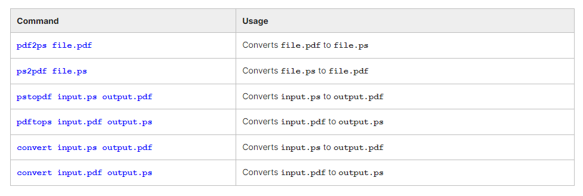

## Chapter 10. Printing and PDF Files

- Configure a printer on a Linux machine.
- Print documents.
- Manipulate postscript and PDF files using command line utilities.

## Printing

### Printing on Linux

To manage printers and print directly from a computer or across a networked environment, you need to know how to configure and install a printer. Printing itself requires software that converts information from the application you are using to a language your printer can understand. The Linux standard for printing software is the Common UNIX Printing System (CUPS).

Modern Linux desktop systems make installing and administering printers pretty simple and intuitive, and not unlike how it is done on other operating systems. Nevertheless, it is instructive to understand the underpinnings of how it is done in Linux.

### CUPS Overview

CUPS is the underlying software almost all Linux systems use to print from applications like a web browser or LibreOffice. It converts page descriptions produced by your application (put a paragraph here, draw a line there, and so forth) and then sends the information to the printer. It acts as a print server for both local and network printers.

Printers manufactured by different companies may use their own particular print languages and formats. CUPS uses a modular printing system which accommodates a wide variety of printers and also processes various data formats. This makes the printing process simpler; you can concentrate more on printing and less on how to print.


Generally, the only time you should need to configure your printer is when you use it for the first time. In fact, CUPS often figures things out on its own by detecting and configuring any printers it locates.

### Configuring a Printer from GUI

Each Linux distribution has a GUI application that lets you add, remove, and configure local or remote printers. Using this application, you can easily set up the system to use both local and network printers. The following screens show how to find and use the appropriate application in each of the distribution families covered in this course.

When configuring a printer, make sure the device is currently turned on and connected either to the system or the network; if so it should show up in the printer selection menu. If the printer is not visible, you may want to troubleshoot using tools that will determine if the printer is connected. For common USB printers, for example, the lsusb utility will show a line for the printer. For network printers, you may need to know what IP address they are assigned. Some printer manufacturers also require some extra software to be installed in order to make the printer visible to CUPS, however, due to the standardization these days, this is rarely required.


### Demo: Adding a Network Printer
TODO

### Adding Printers from the CUPS Web Interface

A fact that few people know is that CUPS also comes with its own web server, which makes a configuration interface available via a set of CGI scripts.

This web interface allows you to:

- Add and remove local/remote printers
- Configure printers:
    – Local/remote printers
    – Share a printer as a CUPS server
- Control print jobs:
    – Monitor jobs
    – Show completed or pending jobs
    – Cancel or move jobs.
The CUPS web interface is available on your browser at: http://localhost:631.

Some pages require a username and password to perform certain actions, for example to add a printer. For most Linux distributions, you must use the root password to add, modify, or delete printers or classes.


### Managing CUPS

Assuming CUPS has been installed you'll need to start and manage the CUPS daemon so that CUPS is ready for configuring a printer. Managing the CUPS daemon is simple; all management features can be done with the systemctl utility:

```
$ systemctl status cups

$ sudo systemctl [enable|disable] cups

$ sudo systemctl [start|stop|restart] cups
```

NOTE: The next screen demonstrates this on Ubuntu, but is the same for all major current Linux distributions. 

### Demo: Managing the CUPS Daemon
TODO

### Printing from the Graphical Interface

Many graphical applications allow users to access printing features using the CTRL-P shortcut. To print a file, you first need to specify the printer (or a file name and location if you are printing to a file instead) you want to use; and then select the page setup, quality, and color options. After selecting the required options, you can submit the document for printing. The document is then submitted to CUPS. You can use your browser to access the CUPS web interface at http://localhost:631/ to monitor the status of the printing job. Now that you have configured the printer, you can print using either the Graphical or Command Line interfaces.

The screenshot shows the GUI interface for CTRL-P for CentOS, other Linux distributions appear virtually identical.


### Printing from the Command-Line Interface

CUPS provides two command-line interfaces, descended from the System V and BSD flavors of UNIX. This means that you can use either **lp** (System V) or **lpr** (BSD) to print. You can use these commands to print text, PostScript, PDF, and image files.

These commands are useful in cases where printing operations must be automated (from shell scripts, for instance, which contain multiple commands in one file). 

**lp** is just a command line front-end to the **lpr** utility that passes input to **lpr**. Thus, we will discuss only lp in detail. In the example shown here, the task is to print **$HOME/.emacs** .


### Using lp

lp and lpr accept command line options that help you perform all operations that the GUI can accomplish. lp is typically used with a file name as an argument.

Some lp commands and other printing utilities you can use are listed in the table:


**lpoptions** can be used to set printer options and defaults. Each printer has a set of tags associated with it, such as the default number of copies and authentication requirements. You can type lpoptions help to obtain a list of supported options. lpoptions can also be used to set system-wide values, such as the default printer.

### Demo: Printing Using lp
TODO

### Try-It-Yourself: Printing with lp

Please take a look at the following Try-It-Yourself exercise: [Printing with lp](http://linuxfoundation.s3-website-us-east-1.amazonaws.com/TIY/usinglp/index.html).

### Managing Print Jobs

Suppose you have sent a file to the shared printer, but when you go there to collect the printout, you discover another user has just started a 200 page job that is not time sensitive. Your file cannot be printed until this print job is complete. What can do you do to cancel printing the long document?

In Linux, command line print job management commands allow you to monitor the job state as well as managing the listing of all printers and checking their status, and canceling or moving print jobs to another printer.

Some of these commands are listed in the table. 


### Try-It-Yourself: Managing Print Jobs
http://linuxfoundation.s3-website-us-east-1.amazonaws.com/TIY/usingprintjobs/index.html
Please take a look at the following Try-It-Yourself exercise: Managing Print Jobs.

### How Does CUPS Work?

CUPS carries out the printing process with the help of its various components:
- Configuration files
- Scheduler
- Job files
- Log files
- Filter
- Printer drivers
- Backend.
You will learn about each of these components on the next few pages.


### Scheduler

CUPS is designed around a print scheduler that manages print jobs, handles administrative commands, allows users to query the printer status, and manages the flow of data through all CUPS components.


We will look at the browser-based interface that can be used with CUPS,  which allows you to view and manipulate the order and status of pending print jobs.

### Configuration Files

The print scheduler reads server settings from several configuration files, the two most important of which are cupsd.conf and printers.conf. These and all other CUPS related configuration files are stored under the /etc/cups/ directory.

cupsd.conf is where most system-wide settings are located; it does not contain any printer-specific details. Most of the settings available in this file relate to network security, i.e. which systems can access CUPS network capabilities, how printers are advertised on the local network, what management features are offered, and so on.

printers.conf is where you will find the printer-specific settings. For every printer connected to the system, a corresponding section describes the printer’s status and capabilities. This file is generated or modified only after adding a printer to the system, and should not be modified by hand.

You can view the full list of configuration files by typing ls -lF /etc/cups.


### Job Files

CUPS stores print requests as files under the /var/spool/cups directory (these can actually be accessed before a document is sent to a printer). Data files are prefixed with the letter d while control files are prefixed with the letter c.


After a printer successfully handles a job, data files are automatically removed. These data files belong to what is commonly known as the print queue.


### Log Files

Log files are placed in /var/log/cups and are used by the scheduler to record activities that have taken place. These files include access, error, and page records.

To view what log files exist, type: ```$ sudo ls -l /var/log/cups```


Note on some distributions permissions are set such that you do not need to use sudo. You can view the log files with the usual tools.


### Filters, Printer Drivers, and Backends

CUPS uses filters to convert job file formats to printable formats. Printer drivers contain descriptions for currently connected and configured printers, and are usually stored under /etc/cups/ppd/. The print data is then sent to the printer through a filter, and via a backend that helps to locate devices connected to the system.


So, in short, when you execute a print command, the scheduler validates the command and processes the print job, creating job files according to the settings specified in the configuration files. Simultaneously, the scheduler records activities in the log files. Job files are processed with the help of the filter, printer driver, and backend, and then sent to the printer.

## Manipulating Postscript and PDF Files

### Working with PostScript and PDF

PostScript is a standard  page description language. It effectively manages scaling of fonts and vector graphics to provide quality printouts. It is purely a text format that contains the data fed to a PostScript interpreter. The format itself is a language that was developed by Adobe in the early 1980s to enable the transfer of data to printers.


Features of PostScript are:

It can be used on any printer that is PostScript-compatible; i.e. any modern printer
Any program that understands the PostScript specification can print to it
Information about page appearance, etc. is embedded in the page.

Postscript has been for the most part superseded by the PDF format (Portable Document Format) which produces far smaller files in a compressed format for which support has been integrated into many applications. However, one still has to deal with postscript documents, often as an intermediate format on the way to producing final documents.

### Working with enscript

enscript is a tool that is used to convert a text file to PostScript and other formats. It also supports Rich Text Format (RTF) and HyperText Markup Language (HTML). For example, you can convert a text file to two columns (-2) formatted PostScript using the command: ```$ enscript -2 -r -p psfile.ps textfile.txt```

This command will also rotate (-r) the output to print so the width of the paper is greater than the height (aka landscape mode), thereby reducing the number of pages required for printing.

The commands that can be used with enscript are listed in the table below (for a file called textfile.txt).


### Converting Between PostScript and PDF

Most users today are far more accustomed to working with files in PDF format, viewing them easily either on the Internet through their browser or locally on their machine. The PostScript format is still important for various technical reasons that the general user will rarely have to deal with.

From time to time, you may need to convert files from one format to the other, and there are very simple utilities for accomplishing that task. ps2pdf and pdf2ps are part of the ghostscript package installed on or available on all Linux distributions. As an alternative, there are pstopdf and pdftops which are usually part of the poppler package, which may need to be added through your package manager. Unless you are doing a lot of conversions or need some of the fancier options (which you can read about in the man pages for these utilities), it really does not matter which ones you use.

Another possibility is to use the very powerful convert program, which is part of the ImageMagick package. Some newer distributions have replaced this with GraphicsMagick, and the command to use is gm convert.

Some usage examples:


### Viewing PDF Content

Linux has many standard programs that can read PDF files, as well as many applications that can easily create them, including all available office suites, such as LibreOffice.

The most common Linux PDF readers are:

evince:  Available on virtually all distributions and is the most widely used program.
okular: Based on the older kpdf and is available on any distribution that provides the KDE environment.
These open source PDF readers support and can read files following the PostScript standard. The proprietary Adobe Acrobat Reader, which was once widely used on Linux systems, is fortunately no longer available, as it did defective rendering and was unstable and poorly maintained.

### Manipulating PDFs

At times, you may want to merge, split, or rotate PDF files; not all of these operations can be achieved while using a PDF viewer. Some of these operations include:
Merging/splitting/rotating PDF documents
Repairing corrupted PDF pages
Pulling single pages from a file
Encrypting and decrypting PDF files
Adding, updating, and exporting a PDF’s metadata
Exporting bookmarks to a text file
Filling out PDF forms.


In order to accomplish these tasks there are several programs available:
qpdf
pdftk
ghostscript.

qpdf is widely available on Linux distributions and is very full-featured. pdftk was once very popular but depended on an obsolete unmaintained package (libgcj) and a number of distributions have dropped it; thus we have recommended avoiding it. However, it has been rewritten in Java and once again is quite usable if your distribution supports it. Ghostscript (often invoked using gs) is widely available and well-maintained. However, its usage is a little complex.

### Using qpdf

You can accomplish a wide variety of tasks using qpdf including:


### Demo: Using qpdf
TODO

### Using pdftk

pdftk has now been ported to Java! Marc Vinyals has developed and maintained a port to Java for pdftk which can be found here. Most distributions now only install this version:

$ sudo apt install pdftk      # Ubuntu/Debian etc
$ sudo dnf install pdftk-java # RHEL/CentOS/Fedora etc.
You can accomplish a wide variety of tasks using pdftk including:


### Encrypting PDF Files with pdftk

If you’re working with PDF files that contain confidential information and you want to ensure that only certain people can view the PDF file, you can apply a password to it using the **user_pw** option. One can do this by issuing a command such as: ```$ pdftk public.pdf output private.pdf user_pw PROMPT```

When you run this command, you will receive a prompt to set the required password, which can have a maximum of 32 characters. A new file, private.pdf, will be created with the identical content as public.pdf, but anyone will need to type the password to be able to view it.


### Using Ghostscript

Ghostscript is widely available as an interpreter for the Postscript and PDF languages. The executable program associated with it is abbreviated to gs.

This utility can do most of the operations pdftk can, as well as many others; see man gs for details. Use is somewhat complicated by the rather long nature of the options. For example:

Combine three PDF files into one:```$ gs -dBATCH -dNOPAUSE -q -sDEVICE=pdfwrite  -sOutputFile=all.pdf file1.pdf file2.pdf file3.pdf```

Split pages 10 to 20 out of a PDF file:
```
$ gs -sDEVICE=pdfwrite -dNOPAUSE -dBATCH -dDOPDFMARKS=false -dFirstPage=10 -dLastPage=20\
-sOutputFile=split.pdf file.pdf
```

### Using Additional Tools

You can use other tools to work with PDF files, such as:

pdfinfo 
It can extract information about PDF files, especially when the files are very large or when a graphical interface is not available.
flpsed 
It can add data to a PostScript document. This tool is specifically useful for filling in forms or adding short comments into the document.
pdfmod 
It is a simple application that provides a graphical interface for modifying PDF documents. Using this tool, you can reorder, rotate, and remove pages; export images from a document; edit the title, subject, and author; add keywords; and combine documents using drag-and-drop action.

For example, to collect the details of a document, you can use the following command:```$ pdfinfo /usr/share/doc/readme.pdf```


## Lab Exercises

### Lab 10.1. The CUPS Web Interface

Bring up http://localhost:631 in your favorite browser.
In the first column (CUPS for Users), you will find a wealth of documentation. Spending some time on it will be profitable.
In the second column (CUPS for Administrators), you will find a lot of configuration information. You can do things like add new printers etc. (once you supply the administrator password etc.)
The third column is CUPS for Developers and is not particularly relevant for this class.


### Lab 10.2. Creating PostScript and PDF from Text Files

Check to see if the enscript package has been installed on your system, and if not, install it.
Using enscript, convert the text file /var/dmesg to PostScript format and name the result /tmp/dmesg.ps. (As an alternative you can use any large text file on our system.)
Make sure you can read the PostScript file (with evince, for example) and compare to the original file.
(Note: On some systems, evince may have problems with the PostScript file, but the PDF file you produce from it will be fine for viewing.)
Convert the PostScript document to PDF format using ps2pdf.
Make sure you can read the resulting PDF file. Does it look identical to the PostScript version?
Is there a way you can go straight to the PDF file without producing a PostScript file on the disk along the way?
Using pdfinfo, determine what PDF version is used to encode the file, the number of pages, the page size, and other metadata about the file. (If you don’t have pdfinfo you probably need to install the poppler-utils package.


