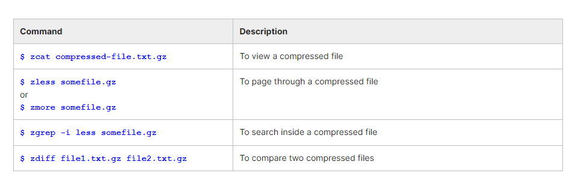
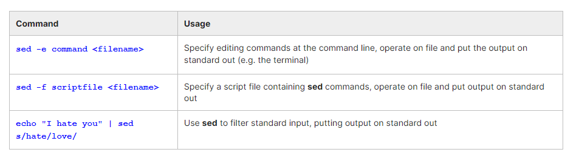
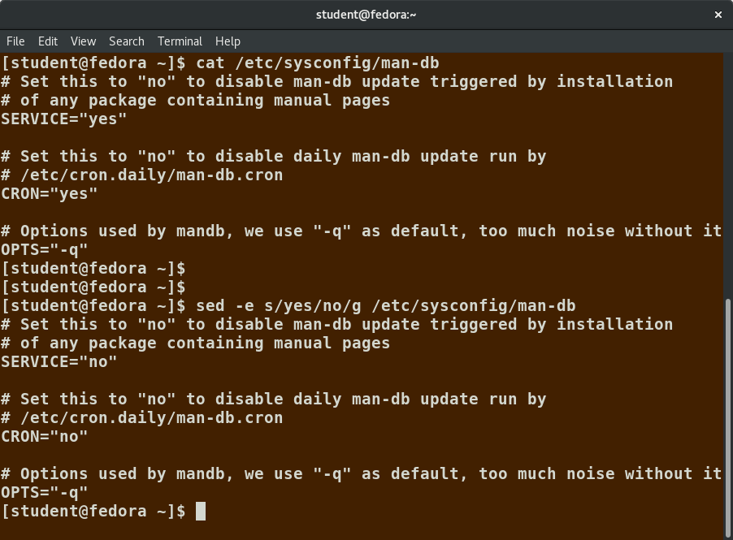
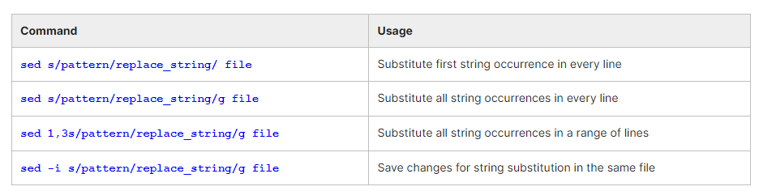
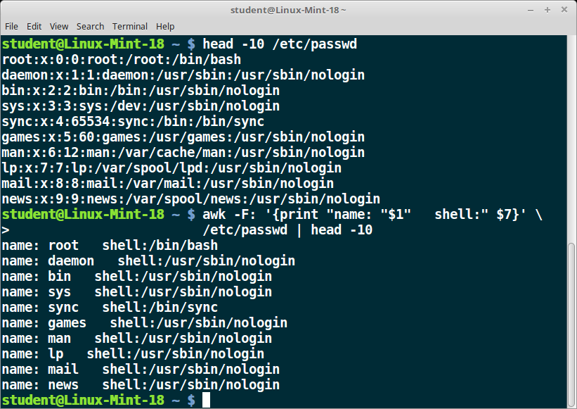
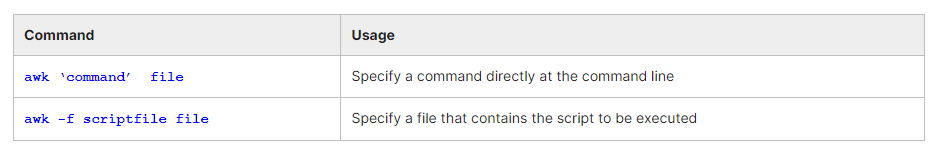
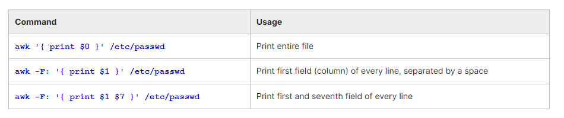
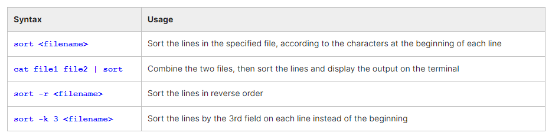
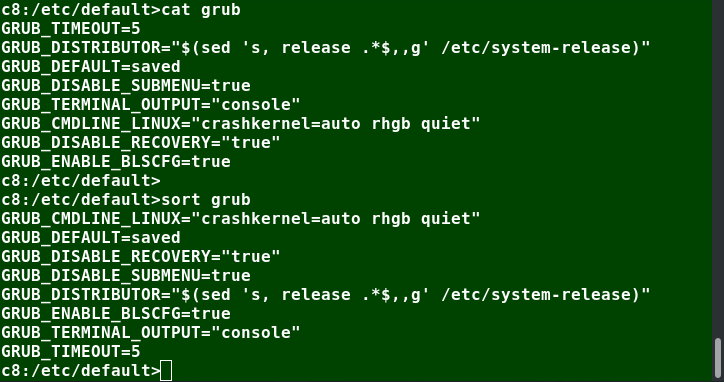
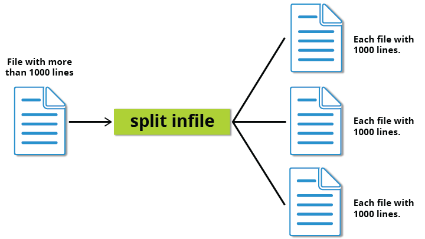

# Chapter 2. File and Text Manipulation Utilities

- Display and append to file contents using cat and echo. 
- Edit and print file contents using sed and awk.
- Search for patterns using grep.
- Use multiple other utilities for file and text manipulation.


## cat

```$ cat <filename>```

**cat is short for concatenate**. For example, ```cat readme.txt``` will display the contents of readme.txt on the terminal. However, the **main purpose of cat is often to combine (concatenate) multiple files together.** You can perform the actions listed in the table using cat.

**The tac command (cat spelled backwards) prints the lines of a file in reverse order.** Each line remains the same, but the order of lines is inverted. The syntax of tac is exactly the same as for cat, as in:
```
$ tac file
$ tac file1 file2 > newfile
```


**cat can be used to read from standard input** (such as the terminal window) if no files are specified. You can use the **> operator to create and add lines into a new file**, and **the >> operator to append lines (or files) to an existing file**. We mentioned this when talking about how to create files without an editor.

To create a new file, at the command prompt type **cat > <filename> and press the Enter key**.
This command creates a new file and waits for the user to edit/enter the text. After you finish typing the required text, **press CTRL-D at the beginning of the next line to save and exit the editing.**


Another way to create a file at the terminal is **cat > <filename> << EOF**. A new file is created and you can type the required input. To exit, **enter EOF at the beginning of a line.**. Note, One can also use another word, such as STOP instead of EOF

## Working with Large Files

### less

System administrators need to work with configuration files, text files, documentation files, and log files. Some of these files may be large or become quite large as they accumulate data with time.

Directly opening the file in an editor will cause issues, due to high memory utilization, as an editor will usually try to read the whole file into memory first. However, **one can use less to view the contents of such a large file, scrolling up and down page by page, without the system having to place the entire file in memory before starting.** This is much faster than using a text editor.

Viewing somefile can be done by typing either of the two following commands:```$ less somefile``` or  ```$ cat somefile | less```

### head

head reads the first few lines of each named file (10 by default) and displays it on standard output. You can give a different number of lines in an option.

For example, if you want to print the first 5 lines from /etc/default/grub, use the following command:
```$ head –n 5 /etc/default/grub``` (or) just ```head -5 /etc/default/grub```

### tail

tail prints the last few lines of each named file and displays it on standard output. By default, it **displays the last 10 lines.** You can give a different number of lines as an option. **tail is especially useful when you are troubleshooting any issue using log files, as you probably want to see the most recent lines of output.**

Display the last 15 lines of somefile.log, use the following command: ```$ tail -n 15 somefile.log``` or just say ```$ tail -15 somefile.log```

**To continually monitor new output in a growing log file: ```$ tail -f somefile.log```**
This command will continuously display any new lines of output in atmtrans.log as soon as they appear.

## Viewing Compressed files

These associated utilities have the letter "z" prefixed to their name. For example, we have utility programs such as zcat, zless, zdiff and zgrep



Note that if you run zless on an uncompressed file, it will still work and ignore the decompression stage. There are also equivalent utility programs for other compression methods besides gzip, for example, we have bzcat and bzless associated with bzip2, and xzcat and xzless associated with xz.

## Text Manipulation - sed

sed is used to modify the contents of a file or input stream, usually placing the contents into a new file or output stream. Its name is an abbreviation for stream editor.

**sed can filter text, as well as perform substitutions in data streams.**

Data from an input source/file (or stream) is taken and moved to a working space. The entire list of operations/modifications is applied over the data in the working space and the final contents are moved to the standard output space (or stream).



The -e option allows you to specify multiple editing commands simultaneously at the command line. It is unnecessary if you only have one operation invoked.






**You must use the -i option with care, because the action is not reversible.**

It is always safer to use sed without the –i option and then replace the file yourself, as shown in the following example: ```$ sed s/pattern/replace_string/g file1 > file2```

The above command will replace all occurrences of pattern with replace_string in file1 and move the contents to file2. The contents of file2 can be viewed with cat file2. If you approve, you can then overwrite the original file with mv file2 file1.

```
Example: To convert 01/02/… to JAN/FEB/…
sed -e 's/01/JAN/' -e 's/02/FEB/' -e 's/03/MAR/' -e 's/04/APR/' -e 's/05/MAY/' \
    -e 's/06/JUN/' -e 's/07/JUL/' -e 's/08/AUG/' -e 's/09/SEP/' -e 's/10/OCT/' \
    -e 's/11/NOV/' -e 's/12/DEC/'
```

## Text Manipulation - awk
awk is used to extract and then print specific contents of a file. sed derived its name from the last names of its authors: Alfred Aho, Peter Weinberger, and Brian Kernighan.

awk has the following features:
- It is a powerful utility and interpreted programming language.
- It is used to manipulate data files, retrieving, and processing text.
- It works well with fields (containing a single piece of data, essentially a column) and records (a collection of fields, essentially a line in a file).



As with sed, short awk commands can be specified directly at the command line, but a more complex script can be saved in a file that you can specify using the -f option:



awk basis:
The table explains the basic tasks that can be performed using awk. **The input file is read one line at a time, and, for each line, awk matches the given pattern in the given order and performs the requested action.** The -F option allows you to specify a particular field separator character. For example, the /etc/passwd file uses ":" to separate the fields, so the -F: option is used with the /etc/passwd file.

**The command/action in awk needs to be surrounded with apostrophes (or single-quote (')).** 



## sort

sort is used to rearrange the lines of a text file, in either ascending or descending order according to a sort key. You can also sort with respect to particular fields (columns) in a file. 



When used with the -u option, sort checks for unique values after sorting the records (lines).


uniq removes duplicate consecutive lines in a text file and is useful for simplifying the text display.

Because uniq requires that the duplicate entries must be consecutive, one often runs sort first and then pipes the output into uniq; if sort is used with the -u option, it can do all this in one step.

To remove duplicate entries from multiple files at once, use the following command:
```sort file1 file2 | uniq > file3``` (or) ```sort -u file1 file2 > file3```

To count the number of duplicate entries, use the following command:```uniq -c filename```

## split

By default, split breaks up a file into 1000-line segments. The original file remains unchanged, and a set of new files with the same name plus an added prefix is created. By default, the x prefix is added.

To split a file into segments using a different prefix, use the command ```split infile <Prefix>```



```
$ wc -l american-english
99171 american-english


$ split american-english dictionary
will split the American-English file into 100 equal-sized segments named dictionaryxx. 
```