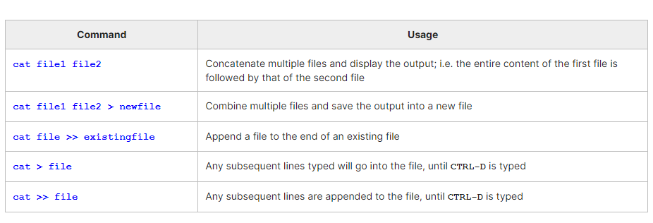
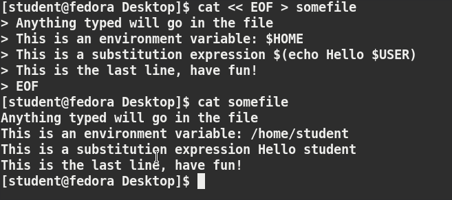

# Chapter 2. File and Text Manipulation Utilities

- Display and append to file contents using cat and echo. 
- Edit and print file contents using sed and awk.
- Search for patterns using grep.
- Use multiple other utilities for file and text manipulation.


## cat

```$ cat <filename>```

**cat is short for concatenate**. For example, ```cat readme.txt``` will display the contents of readme.txt on the terminal. However, the **main purpose of cat is often to combine (concatenate) multiple files together.** You can perform the actions listed in the table using cat.

**The tac command (cat spelled backwards) prints the lines of a file in reverse order.** Each line remains the same, but the order of lines is inverted. The syntax of tac is exactly the same as for cat, as in:
```
$ tac file
$ tac file1 file2 > newfile
```



**cat can be used to read from standard input** (such as the terminal window) if no files are specified. You can use the **> operator to create and add lines into a new file**, and **the >> operator to append lines (or files) to an existing file**. We mentioned this when talking about how to create files without an editor.

To create a new file, at the command prompt type **cat > <filename> and press the Enter key**.
This command creates a new file and waits for the user to edit/enter the text. After you finish typing the required text, **press CTRL-D at the beginning of the next line to save and exit the editing.**



Another way to create a file at the terminal is **cat > <filename> << EOF**. A new file is created and you can type the required input. To exit, **enter EOF at the beginning of a line.**. Note, One can also use another word, such as STOP instead of EOF

## Working with Large Files

### less

System administrators need to work with configuration files, text files, documentation files, and log files. Some of these files may be large or become quite large as they accumulate data with time.

Directly opening the file in an editor will cause issues, due to high memory utilization, as an editor will usually try to read the whole file into memory first. However, **one can use less to view the contents of such a large file, scrolling up and down page by page, without the system having to place the entire file in memory before starting.** This is much faster than using a text editor.

Viewing somefile can be done by typing either of the two following commands:```$ less somefile``` or  ```$ cat somefile | less```

### head

head reads the first few lines of each named file (10 by default) and displays it on standard output. You can give a different number of lines in an option.

For example, if you want to print the first 5 lines from /etc/default/grub, use the following command:
```$ head –n 5 /etc/default/grub``` (or) just ```head -5 /etc/default/grub```

### tail

tail prints the last few lines of each named file and displays it on standard output. By default, it **displays the last 10 lines.** You can give a different number of lines as an option. **tail is especially useful when you are troubleshooting any issue using log files, as you probably want to see the most recent lines of output.**

Display the last 15 lines of somefile.log, use the following command: ```$ tail -n 15 somefile.log``` or just say ```$ tail -15 somefile.log```

**To continually monitor new output in a growing log file: ```$ tail -f somefile.log```**
This command will continuously display any new lines of output in atmtrans.log as soon as they appear.

