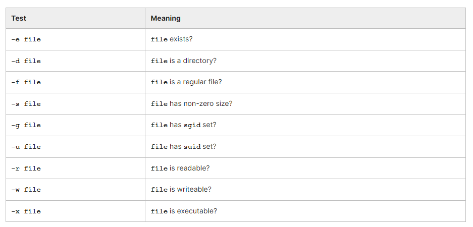
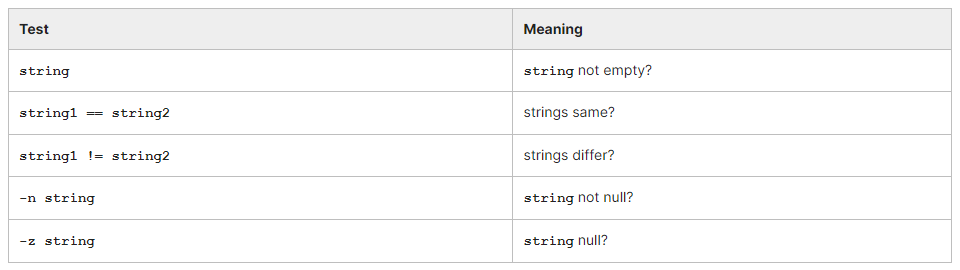

# Chapter 3. Bash Scripting

- Execute bash scripts and specify arguments that they operate on, and how to use debugging options.
- Use conditional constructs in multiple ways.
- Run tests on file properties, string comparisons, and arithmetic expressions.
- Use the case switching construct.
- Use the various looping mechanisms: for, while, and until.
- Use functions (subprograms) inside scripts.

## Script Basics

A script say my_script.sh can be invoked in either of two ways:

- Typing ```bash my_script.sh```
- Have the first line of my_script.sh be **#!/bin/sh**. Note this will work with any other interpreter such as csh, perl, etc. This is an exception to the rule that the character # is used to demark comments. Then, make the script executable by doing **chmod +x my_script.sh**, and then just run **./my_script.sh**.

Special environment variables that can be used inside a script:

- $0 is the command name
- $1 $2 ... are the command arguments
- $* represents them all
- $@ represents them all, preserving the grouping of quoted arguments
- $# gives the number of arguments.
- $? holds the exit status of the previous command.

Note: You should often enclose these variables in double quotes, i.e. you should say "$@" to preserve the argument grouping. In addition, you will get syntax errors when doing comparisons if the string is empty, if you do not use double quotes.

Inside the script, the **command shift n shifts the arguments n times (to the left).**

There are two ways to include a script file inside another script:
- ```. file```
- ```source file```

There is a number of options that can be used for debugging purposes:
- **set -n (bash -n)** just checks for syntax
- **set -x (bash -x)** echoes all commands after running them
- **set -v (bash -v)** echoes all commands before running them
- **set -u (bash -u)** causes the shell to treat using unset variables as an error
- **set -e (bash -e)** causes the script to exit immediately upon any non-zero exit status
where the set command is used inside the script (with a + sign behavior is reversed) and the second form, giving an option to ​bash, is invoked when running the script from the command line.

### NoClobber

Turn on NoClobber option: ```set -o noclobber```

Disable NoClobber option: ```set +o noclobber```

NoClobber is an option that we can use to disallow an operation to overwriting any existing files.
If NoClobber option is ON. ```echo "Hai" > outputfile.txt```
- If the file outputfile.txt isn’t already exist, the command will be executed successfully.
- But, if the outfile.txt was an existing file, we will got an error 
With NoClobber option ON which you don’t wanted to disable it permanently and just for this specific operations we can use this command: ```echo "Hai" >! outputfile.txt```


If you want to enable NoClobber on your all shell session, simply put:
```
### if you are using bash
echo 'set -o noclobber' >> ~/.bash_profile

### if you are using zsh
echo 'set -o noclobber' >> ~/.zshrc
```

## Conditionals

bash permits control structures like:

```
if condition
then
   statements
else
   statements
fi
```

There is also an elif statement.

The condition can be expressed in several equivalent ways:
- ```​if [[ -f file.c ]] ; then ... ; fi```
- ```if [ -f file.c ] ; then ... ; fi```
- ```if test -f file.c ; then ... ; fi```
​Note: Remember to put spaces around the [ ] brackets. Also, The first form with **double brackets is preferred over the second form with single brackets** which is now considered deprecated

if [ $VAR == "" ] will produce a syntax error if VAR is empty, so you have to do:
​if [ "$VAR" == "" ] to avoid this.

The test form is also deprecated for the same reason, and it is more clumsy as well. However, it is common to see these older conditional forms in many legacy scripts.

You will often see the ```&& and || operators (AND and OR, as in C)``` used in a compact shorthand:
```
$ make && make modules_install && make install
$ [[ -f /etc/foo.conf ]] || echo 'default config' >/etc/foo.conf
```

The && operator can be used to do compact conditionals, e.g. the statement:

```[[ $STRING == mystring ]] && echo mystring is "$STRING"```
is equivalent to:
```
if [[ $STRING == mystring ]] ; then
    echo mystring is "$STRING"
fi
```

## File Conditionals

Doing **man 1 test** will enumerate these tests.



## String and Arithmetic Comparisons

If you use single square brackets or the test syntax, be sure to enclose environment variables in quotes in the following:


Arithmetic comparisons take the form:​ ```exp1 -op exp2```
where the operation (-op) can be:```-eq, -ne, -gt, -ge, -lt, -le```

## case

This construct is similar to the switch construct used in C code. For example:

```
#!/bin/sh

echo "Do you want to destroy your entire file system?"
read response

case "$response" in
"yes") echo "I hope you know what you are doing!" ;;
"no" ) echo "You have some comon sense!" ;;
"y" | "Y" | "YES" ) echo "I hope you know what you are doing!" ;
echo 'I am going to type: " rm -rf /"';;
"n" | "N" | "NO" ) echo "You have some comon sense!" ;;
* ) echo "You have to give an answer!" ;;
esac
exit 0
```

## Loops

### for

```
$ for file in $(find . -name "*.o")
do
    echo "I am removing file: $file"
    rm -f "$file"
done
```

​which is equivalent to: ```​$ find . -name "*.o" -exec rm {} ';'``` or ```$ find . -name "*.o" | xargs rm```
showing use of the xargs utility.

### while

```
#!/bin/sh

ntry_max=4 ; ntry=0 ; password=' '

while [[ $ntry -lt $ntry_max ]] ; do

   ntry=$(( $ntry + 1 ))
   echo -n 'Give password:  '
   read password
   if  [[ $password == "linux" ]] ; then
       echo "Congratulations: You gave the right password on try $ntry!"
       exit 0
   fi
   echo "You failed on try $ntry; try again!"

done

echo "you failed $ntry_max times; giving up"
exit -1
```

### until
```
#!/bin/sh

ntry_max=4 ; ntry=0 ; password=' '

until [[ $ntry -ge $ntry_max ]] ; do

   ntry=$(( $ntry + 1 ))
   echo -n 'Give password:  '
   read password
   if [[ $password == "linux" ]] ; then
       echo "Congratulations: You gave the right password on try $ntry!"
       exit 0
   fi
   echo "You failed on try $ntry; try again!"

done

echo "you failed $ntry_max times; giving up"
exit -1
```

## Functions

bash permits use of subprograms or functions. Alternatively, one script can call another script, but this can make passing information a little more complex, and increases the number of files. Proper use of functions can make scripts much simpler.

The basic form of a function is:
```
fun_foobar(){
statements
}
```

Few Things to Note. The above function declaration which will not look strange to any C programmer.
- No arguments are enclosed in the parentheses.
- Functions must always be defined before they are used, because scripts are interpreted, not compiled
- Functions leave positional arguments unchanged, but can reset other variables. A ```local var1 var2...``` statement can make variables local.


For example:

```
​#!/bin/sh

test_fun1(){
var=FUN_VAR
shift
echo " PARS after fun shift: $0 $1 $2 $3 $4 $5"
}

var=MAIN_VAR
echo ' '
echo "BEFORE FUN MAIN, VAR=$var"
echo " PARS starting in main: $0 $1 $2 $3 $4 $5"

test_fun1 "$@"
echo " PARS after fun in main: $0 $1 $2 $3 $4 $5"
echo "AFTER FUN MAIN, VAR=$var"

exit 0
```


Sometimes, you will see an older method of declaring functions, which explicitly includes a function keyword, as in:

```
function fun_foobar(){
statements
}
```
or

```
function fun_foobar{
statements
}
```
without the parentheses.

This syntax will work fine in bash scripts, but is not designed for the original Bourne shell, sh.
In the case where a function name is used, which collides with an alias, this method will still work.
In most cases, **the function keyword is not often present in new scripts.**

## Lab 3.1. Creating Simple Bash Shell Scripts

In the Labs directory (or anywhere you choose), create the following file in your favorite text editor and call it nproc.sh:

```
#!/bin/sh
nproc=$(ps | wc -l)
echo "You are running $nproc processes"
exit 0
```

In this example, we have used the following commands:
- wc counts the number of lines, words, and characters in a file
- ps gives information about running processes

Now make it executable with: ```$ chmod +x nproc```
Then run it with:```$ ./nproc```

Type ps at the command line. You will notice there is one extra line of headings; thus, we have over-counted by one. Edit the script to correct this.

Hint: you can use either of these two forms:
```nproc=$(($nproc - 1 ))```
```nproc=$(expr $nproc - 1)```

Can you do this exercise without using any variables (i.e., do it in one line)?
Hint: you will find it easier with the ```$(...)``` construct than with the  construct.

```
#!/bin/sh

set -x

########################################################*****
nproc=$(ps | wc -l)

nproc=$(($nproc - 1 ))
# or nproc=$(expr $nproc - 1)

echo "You are running $nproc processes"
#exit 0
########################################################*****

#one line, method 1
echo "You are running $( expr $(ps | wc -l) - 1 )  processes" 

########################################################*****

#one line, method 2
echo "You are running $((     $(ps | wc -l) - 1 )) processes" 

########################################################*****
```

You can download a script with the above steps from s_03/lab_nproc.sh. If you have not yet downloaded the SOLUTIONS file, please see the Lab Exercises - Files to Download page in the Welcome chapter for instructions.


## Lab 3.2. A Simple Backup Utility

Construct a shell script that works as a basic backup utility. It should be invoked as:```$ Backup Source Target```

For each directory under Source, a directory should be created under Target.

Each directory in Target should get a file named BACKUP.tar.gz which contains the compressed contents of the directory.

You should not need permission to write in the Source directory area, but obviously, you will need permission to write in Target.

A good way to test it might be to use /var as the source.

Please Note:
- Functions can be called recursively, but you do not have to do so.
- Some of the utilities and commands you might need are: tar, gzip, find, pushd, popd, cp, echo, mkdir ....

EXTRA CREDIT: Try making it an incremental backup; only do those directories which have changed since the last backup. This can be made very complicated, but just consider cases where there are files newer than when the backup was made.

```
#!/bin/sh

usage="Usage: Backup Source Target"

if [[ $# -lt 2 ]] ; then
   echo -e '\n'    $usage '\n'
   exit 1
fi

if ! [[ -d $1 ]] ; then
   echo -e '\n' ERROR: First argument must be a Directory that exists: quitting'\n'
   exit 1
fi

SOURCE=$1
TARGET=$2

DIRLIST=$(cd $SOURCE ; find . -type d )
# echo DIRLIST= $DIRLIST

for NAMES in $DIRLIST 
do
        SOURCE_DIR=$SOURCE/$NAMES
        TARGET_DIR=$TARGET/$NAMES
        echo "SOURCE= $SOURCE_DIR      TARGET=$TARGET_DIR"
        FILELIST=$( (cd $SOURCE_DIR ; find . -maxdepth 1 ! -type d ) )
        mkdir -p $TARGET_DIR
        OLDIFS=$IFS

IFS='
'
        tar -zcvf $TARGET_DIR/Backup.tar.gz  -C $SOURCE_DIR $FILELIST
        IFS=$OLDIFS
done
```

You can download a script with the above steps from s_03/lab_backup_nor.sh. 

```
#!/bin/sh

StripDotSlash(){
result=""
for names in $1 ; do 
       result="$result $(basename $names)"
       done
    echo "$result"
}

GetFileNames(){
    StripDotSlash "$(find . -maxdepth 1 -not -type d )"
}

GetDirNames(){
    StripDotSlash "$(find . -maxdepth 1 -mindepth 1 -type d)"
}

DoDir(){
    local dirnames filenames R_SOURCE R_TARGET
    DIRNO=$(( $DIRNO + 1))
    cd $1
    echo  "DIRNO=$DIRNO    SOURCEDIR= $1    TARGETDIR = $2"
    dirnames=$(GetDirNames)
    filenames=$(GetFileNames) ;
    if [[ -n $filenames ]] ; then
        tar -zcf $2/Backup.tar.gz $filenames
    fi

    for R_SOURCE in $dirnames ; do
        R_TARGET=$2/$R_SOURCE
        mkdir -p $R_TARGET
        DoDir $1/$R_SOURCE$R_TARGET
    done
}

###########################################################################

SOURCE=$1
TARGET=$2

# Make sure the target directory is a full path name

#if ! [[ $(echo "$TARGET" | grep -q ^\/) ]] ; then
if ! [[ $(echo "$TARGET" | grep ^\/) ]] ; then
    echo -n TARGET was $TARGET: AFTER ADDING FULL PATH:
    TARGET=$(pwd)\/$TARGET
    echo TARGET now is $TARGET
fi

DIRNO=0
usage="Usage: Backup Source Target"

if [[ $# -lt 2 ]] ; then
    echo -e '\n'    $usage '\n'
    exit 1
fi

if ! [[ -d $1 ]] ; then
    echo -e '\n' ERROR: First argument must be a Directory that exists: quitting'\n'
    exit 1
fi

# Make sure the target directory exists
mkdir -p $TARGET

DoDir $SOURCE $TARGET

echo "Backup Successfully Done"
exit 0
###########################################################################
```

You can download a script with the above steps from s_03/lab_backup_r.sh.

## References
- https://ryanstutorials.net/bash-scripting-tutorial/bash-functions.php

