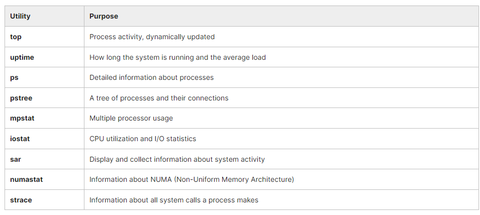
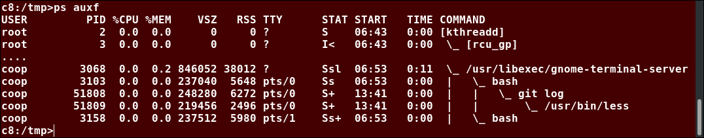
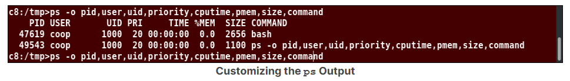
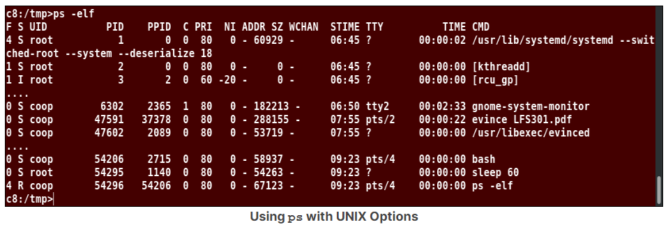
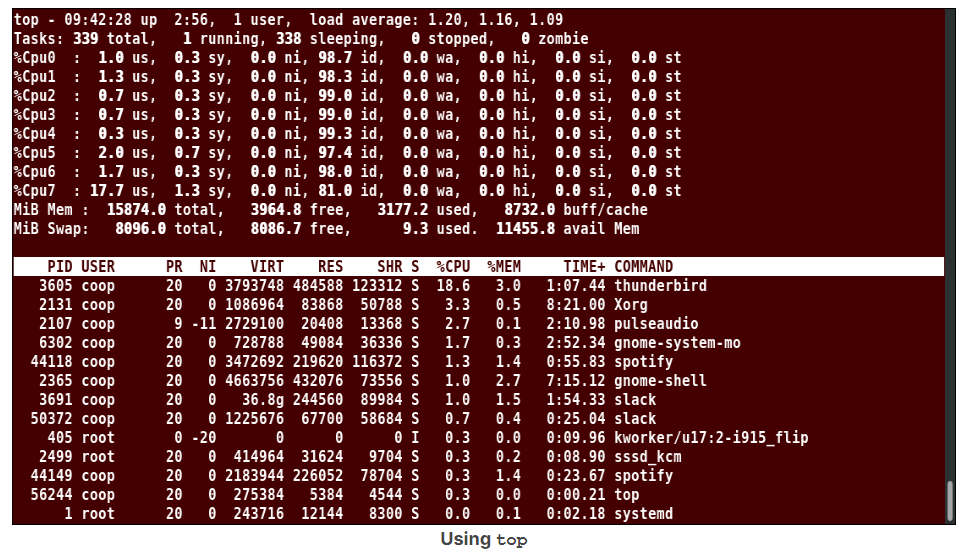
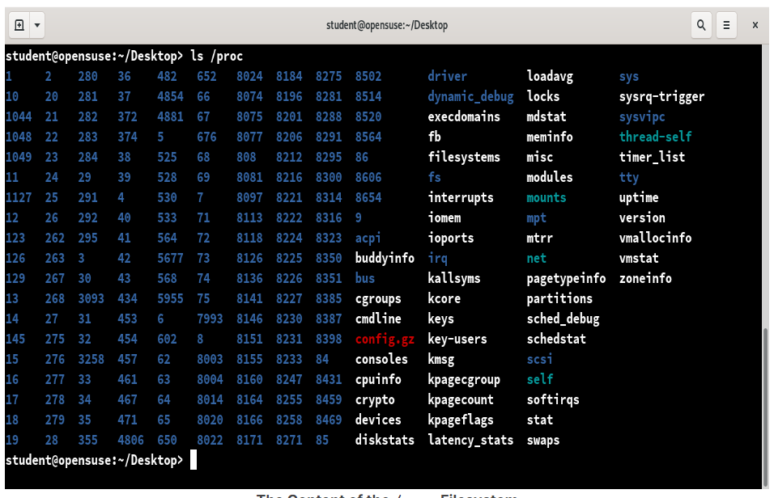

## Chapter 5. Processes and System Monitoring

Monitoring your system is important to make sure it is operating at peak performance, that applications are behaving properly, and that you are not being attacked by some hostile actor that is corrupting the system.

There are many different command line tools which are used for monitoring, and we will tend to use them in this course, though there are graphical tools available. The graphical tools vary quite a bit from Linux distribution to Linux distribution. So, most Linux system administrators concentrate on the command line tools.

- We will look at process monitoring and the two main tools used every day are ‘top’ and ‘ps’.
- We will examine memory usage using programs like ‘free’ and ‘vmstat’.
- Understand the concept of inventory and gain familiarity with available system monitoring tools.
- Understand where the system stores log files and examine the most important ones.
- Use the /proc and /sys pseudo-filesystems.
- Use sar to gather system activity and performance data and create reports that are readable by humans.

## System Monitoring

### Monitoring Tools

While there are a number of graphical system monitors that hide many of the details, we will consider primarily the command line tools in this course.

Linux distributions come with many standard performance and profiling tools already installed. Many of them are familiar from other UNIX-like operating systems while some were developed specifically for Linux.

Most of these tools make use of mounted pseudo-filesystems, especially **/proc** and secondarily **/sys**, both of which we have already discussed when examining filesystems, and will revisit when we take up kernel configuration.

The **/proc** and **/sys** pseudo-filesystems contain a lot of information about the system. Furthermore, many of the entries in these directory trees are writable and can be used to change system behavior; in most cases this requires a root user.

Like **/dev**, these are pseudo-filesystems because they exist totally in memory; if you look at the disk partition when the system is not running there will be only an empty directory which is used as a mount point.

Furthermore, the information displayed is gathered only when it is looked at; there is no constant or periodic polling to update entries.

Graphical system monitors available on all Linux distributions:
- gnome-system-monitor
- ksysguard

**Table: Process and Load Monitoring Utilities**


**Table: Memory Monitoring Utilities**


**Table: I/O Monitoring Utilities**


**Table: Network Monitoring Utilities**


### Log Files

System log files are essential for monitoring and troubleshooting. In Linux, these messages appear in various files under /**var/log**. Exact names vary with Linux distribution.

Ultimate control of how messages are dealt with is controlled by the syslogd (usually rsyslogd on modern systems) daemon, common to many UNIX-like operating systems. The newer systemd-based systems can use journalctl instead, but usually retain syslogd and cooperate with it.

​Important messages are sent not only to the logging files, but also to the system console window; if you are not running a graphical interface or are at a virtual terminal, you will see them directly there as well. In addition, these messages will be copied to **/var/log/messages (on RHEL)** or to **/var/log/syslog (on Ubuntu)**, but if you are running X or Wayland, you have to take some steps to view them as they come in fresh.

- You can view new messages continuously as new lines appear with: ```$ sudo tail -f /var/log/messages```
- Show only kernel-related messages: ```$ dmesg -w```

### Important Log Files

A good way to see log messages is to open a terminal window, and in that window type tail -f /var/log/messages.

On a GNOME desktop, you can also access the messages by clicking on System -> Administration -> System Log or Applications -> System Tools -> Log File Viewer in your Desktop menus. Other desktops have similar links you can locate.

Table: Some important log files found under /var/log


​In order to keep log files from growing without bound, the **logrotate** program is run periodically and keeps four previous copies (by default) of the log files (optionally compressed) and is controlled by **/etc/logrotate.conf**.

### Demo: Available System Monitoring Tools
TODO

## Process

### Process Monitoring Tools

In this section, we will concentrate on process monitoring. To monitor processes, Linux administrators make use of many utilities, such as **ps, pstree and top**, all of which have long histories in UNIX-like operating systems.

Let's review the list of some of the main tools for process monitoring:


The /proc filesystem can also be helpful in monitoring processes, as well as other items, on the system.

### Viewing Process States with 'ps'

**ps** is a workhorse for displaying characteristics and statistics associated with processes, all of which are garnered from the **/proc** directory associated with the process.

Some common choices of options are:
```
$ ps aux
$ ps -elf
$ ps -eL
$ ps -C "bash"
```

This command utility has existed in all UNIX-like operating system variants, and that diversity is reflected in the complicated potpourri of options that the Linux version of ps accepts, which fall into three categories:
- UNIX options, which must be preceded by -, and which may be grouped.
- BSD options, which must not be preceded by -, and which may be grouped.
- GNU long options, each of which must be preceded by --.

Having all these possible options can make life rather confusing. Most system administrators tend to use one or two standard combinations for their daily use.


Image: Using ps with BSD Options

### Customizing the 'ps' Output

If you use the -o option, followed by a comma-separated list of field identifiers, you can print out a customized list of ps fields:
- pid: Process ID number
- uid: User ID number
- cmd: Command with all arguments
- cputime: Cumulative CPU time
- pmem: Ratio of the process's resident set size to the physical memory on the machine, expressed as a percentage.

You can consult the ps man page for many other output options.



Another common options choice is -elf:


### Using 'pstree'

**pstree** gives a visual description of the process ancestry and multi-threaded applications, showing the user the relationships between parent-child processes: 
```
$ pstree -aAp 2408
bash,2408
|-emacs,24998 pmonitor.tex
|   |-{emacs},25002
|   `-{emacs},25003
|-evince,18036 LFD108-SLIDES.pdf
|   |-{evince},18040
|   |-{evince},18046
|   `-{evince},18047
```

Note that one of its child processes (evince, pid=18036) has three children of its own. Another way to see that is:

```
$ ls -l /proc/18036/task

total 0
dr-xr-xr-x 5 coop coop 0 Sep 11 07:15 18036
dr-xr-xr-x 5 coop coop 0 Sep 11 07:15 18040
dr-xr-xr-x 5 coop coop 0 Sep 11 07:15 18046
dr-xr-xr-x 5 coop coop 0 Sep 11 07:15 18047
```

Consult the man page for pstree for an explanation of many options; in the above we have chosen just to show information for pid=2408.

You can use -p to show process IDs, and -H [pid] to highlight [pid] and its ancestors.
```
$ pstree -aAps 31478
systemd,1 --switched-root --system --deserialize 21
  `-vmplayer, 31478
      |-{vmplayer},31570
      |-{vmplayer},31593
      |-{vmplayer},32752
      `-{vmplayer}32698
```

### Using 'top'

top is used to display processes with the highest CPU usage. Processes are initially sorted by CPU usage.

If not run in secure mode (top s), the user can signal processes:
- Press the k key
- Give a PID when prompted
- Give a signal number when prompted.

top is an ancient utility and has a ton of options, as well as interactive commands triggered when certain keys are pressed.

For example, hit the h key to get a list of key bindings. The display may be sorted by a number of different criteria. The display is refreshed every 5 seconds (though this is configurable) and continues to run until the user interrupts it (Ctrl-C).



### More on '/proc'

The /proc filesystem is an interface to the kernel data structures. **/proc** contains a subdirectory for each active process, named by the process id (PID). **/proc/self** is the currently executing process. Some tunable parameters are in the /proc directories. For more info, see the proc man page.

In the sample output below, notice the sub-directories of the /proc filesystem which have numeric values for names. These ASCII numeric strings represent the PIDs of all active processes on the system. Each subdirectory contains additional files with information about that process.



### Background and Foreground Processes

Processes run in the foreground by default. Adding an ampersand **(&)** after a command will run the command in the background: ```$ updatedb &```

Using Ctrl-Z, you can suspend a foreground process. The **bg** command makes it run in the background. The **fg** command puts it back in the foreground. **Ctrl-C** terminates a foreground process.

Foreground jobs run from the shell, making access to the shell wait until the job has finished. This may not be a problem, but if the job will takes a long time to complete, putting it in the background frees up the shell for further interactive work. The background job will run at a lower priority allowing interactive work to go smoothly. You can also log off the terminal window without affecting the background job.
```
$ update &
[1] 22209

$ sleep 100
^Z
[2]+ Stopped   sleep 100

$ bg
[2]+ sleep 100 &

$ fg
sleep 100
^Z
[2]+ Stopped   sleep 100

$ bg
[2]+ sleep 100

$ fg
sleep 100
^C
```

### Managing Jobs

The jobs command shows the background processes in the current terminal: it shows the job ID, the state and the command name. The job ID can be used with **bg** and **fg**.

```
$ jobs
1 - Running   updatedb &
2 + Stopped   sleep 10
```

The following command:```$ jobs -l``` will provide the PID for the job.

The background jobs are still somewhat connected to the terminal window in that, if you log off, jobs will no longer show the jobs started from that window.

### Using 'at' to Start in the Future

The **at** command executes any non-interactive command at a specified time. For example, to start executing a command after a delay, run:
```
$ at now + 2 days
at> mail < /var/log/messages admin@example.com
at> <EOT>
job 1 at 2013-01-16 13:24
```

By entering at with the future time, the interactive part of **at** will start. At the prompt, enter in the command to run, hit enter, then **Ctrl-d** to exit. You then use **atq** to see the job information.

### Using 'cron'

**cron** is a very useful and flexible tool. It is used for any job that needs to run on a regular schedule (e.g., backups). It can be managed in different ways:
- crontab lets users specify jobs
- /etc/cron.d/ can be extended with formatted job files
- /etc/cron.{hourly,daily,weekly,monthly} can obtain any system script

Tasks can be queued to run every hour, every day, once a week or once a month, or even every 10 seconds. Mail will be sent when a job has completed or failed.
```
$ ls -l /etc/cron.d
total 16
-rw-r--r-- 1 root root 128 Mar 29  2017 0hourly
-rw-r--r-- 1 root root  78 Dec 29 09:24 atop
-rw-r--r-- 1 root root 108 Jun 13  2017 raid-check
-rw------- 1 root root 235 Mar 29  2017 sysstat
```

```
$ ls -l /etc/cron.d.daily
total 68
-rwxr-xr-x 1 root root   302 Mar  7 08:55 docker-latest-logrotate
-rwxr-xr-x 1 root root 18812 Mar 20 00:01 google-chrome
-rwxr-xr-x 1 root root     1 Jan     2017 google-earth
lrwxrwxrwx 1 root root    45 Jun 16  2016 google-talkplugin -> /opt/google/talkplugin/cron/google-talkplugin
-rwx------ 1 root root   219 Jan 24  2017 logrotate
-rwxr-xr-x 1 root root   618 Mar 17  2014 man-db.cron
-rwx------ 1 root root   208 Feb  4  2016 mlocate
-rwxr-x--- 1 root root  2126 Aug 17  2016 prelink
-rwx------ 1 root root   256 Sep  1  2017 rhsmd
-rwxrwxr-x 1 root root 18775 Mar  5 13:55 slack
```

While cron has been used in UNIX-like operating systems for decades, modern Linux distributions have moved over to **anacron**, which will be explained shortly.

### Using 'anacron'

On older Linux systems, **crontab** contained information about when to run the jobs in the **/etc/cron.*** subdirectories. However, it was implicitly assumed the machine was always running. If the machine was powered off, scheduled jobs would not run.

**anacron** has replaced **cron** on modern systems. anacron will run the necessary jobs in a controlled and staggered manner when the system is running. The key configuration file is **/etc/anacrontab**.

You can see an example of an anacron configuration file below:

```
# /etc/anacrontab: configuration file for anacron

# See anacron(8) and anacrontab(5) for details.

SHELL=/bin/sh
PATH=/sbin:/bin:/usr/sbin:/usr/bin
MAILTO=root
# the maximal random delay added to the base delay of the jobs
RANDOM_DELAY=45
# the jobs will be started during the following hours only
START_HOURS_RANGE=3-22

#period in days delay in minutes job-identifier command
1          5  cron.daily    nice run-parts /etc/cron.daily
7         25  cron.weekly   nice run-parts /etc/cron.weekly
@monthly  45  cron.monthly  nice run-parts /etc/cron.monthly
```

### Sleeping

**sleep** can be used in shell scripts, as well, for example, as a reminder every 10 minutes that a meeting time is approaching.

The sleep command can be used to easily delay commands:```$ (sleep 600; launchbackup.sh) &```

## Memory Monitoring and Tuning

### Memory Monitoring


