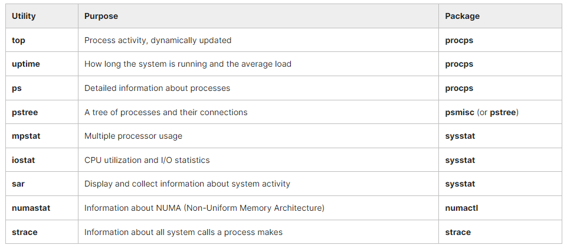
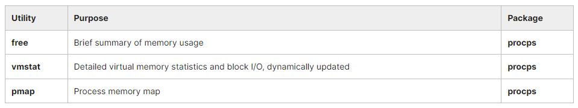
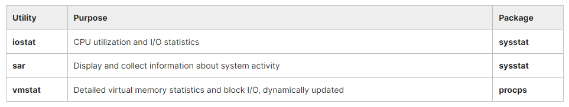
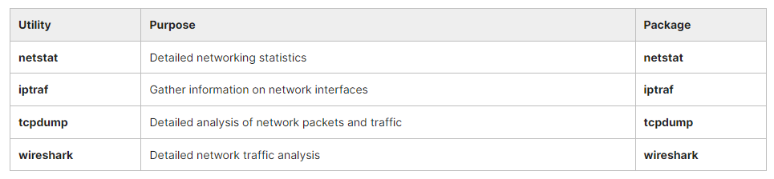
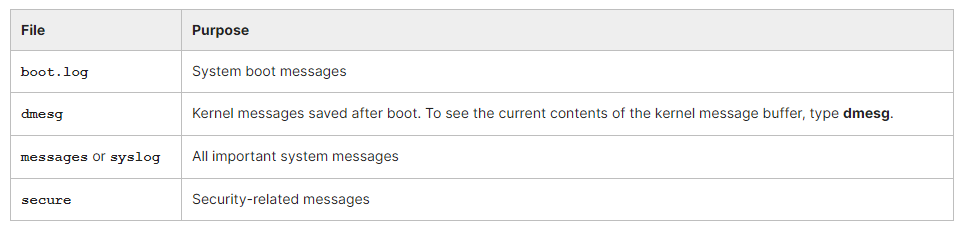

## Chapter 5. Processes and System Monitoring

Monitoring your system is important to make sure it is operating at peak performance, that applications are behaving properly, and that you are not being attacked by some hostile actor that is corrupting the system.

There are many different command line tools which are used for monitoring, and we will tend to use them in this course, though there are graphical tools available. The graphical tools vary quite a bit from Linux distribution to Linux distribution. So, most Linux system administrators concentrate on the command line tools.

- We will look at process monitoring and the two main tools used every day are ‘top’ and ‘ps’.
- We will examine memory usage using programs like ‘free’ and ‘vmstat’.
- Understand the concept of inventory and gain familiarity with available system monitoring tools.
- Understand where the system stores log files and examine the most important ones.
- Use the /proc and /sys pseudo-filesystems.
- Use sar to gather system activity and performance data and create reports that are readable by humans.

## System Monitoring

### Monitoring Tools

While there are a number of graphical system monitors that hide many of the details, we will consider primarily the command line tools in this course.

Linux distributions come with many standard performance and profiling tools already installed. Many of them are familiar from other UNIX-like operating systems while some were developed specifically for Linux.

Most of these tools make use of mounted pseudo-filesystems, especially **/proc** and secondarily **/sys**, both of which we have already discussed when examining filesystems, and will revisit when we take up kernel configuration.

The **/proc** and **/sys** pseudo-filesystems contain a lot of information about the system. Furthermore, many of the entries in these directory trees are writable and can be used to change system behavior; in most cases this requires a root user.

Like **/dev**, these are pseudo-filesystems because they exist totally in memory; if you look at the disk partition when the system is not running there will be only an empty directory which is used as a mount point.

Furthermore, the information displayed is gathered only when it is looked at; there is no constant or periodic polling to update entries.

Graphical system monitors available on all Linux distributions:
- gnome-system-monitor
- ksysguard

**Table: Process and Load Monitoring Utilities**


**Table: Memory Monitoring Utilities**


**Table: I/O Monitoring Utilities**


**Table: Network Monitoring Utilities**


### Log Files

System log files are essential for monitoring and troubleshooting. In Linux, these messages appear in various files under /**var/log**. Exact names vary with Linux distribution.

Ultimate control of how messages are dealt with is controlled by the syslogd (usually rsyslogd on modern systems) daemon, common to many UNIX-like operating systems. The newer systemd-based systems can use journalctl instead, but usually retain syslogd and cooperate with it.

​Important messages are sent not only to the logging files, but also to the system console window; if you are not running a graphical interface or are at a virtual terminal, you will see them directly there as well. In addition, these messages will be copied to **/var/log/messages (on RHEL)** or to **/var/log/syslog (on Ubuntu)**, but if you are running X or Wayland, you have to take some steps to view them as they come in fresh.

- You can view new messages continuously as new lines appear with: ```$ sudo tail -f /var/log/messages```
- Show only kernel-related messages: ```$ dmesg -w```

### Important Log Files

A good way to see log messages is to open a terminal window, and in that window type tail -f /var/log/messages.

On a GNOME desktop, you can also access the messages by clicking on System -> Administration -> System Log or Applications -> System Tools -> Log File Viewer in your Desktop menus. Other desktops have similar links you can locate.

Table: Some important log files found under /var/log


​In order to keep log files from growing without bound, the **logrotate** program is run periodically and keeps four previous copies (by default) of the log files (optionally compressed) and is controlled by **/etc/logrotate.conf**.

### Demo: Available System Monitoring Tools
TODO

