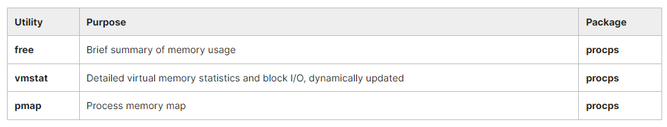
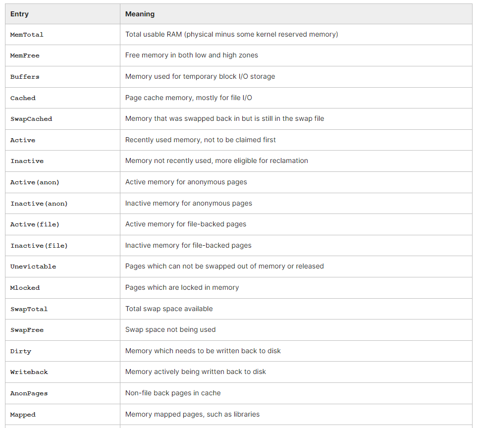
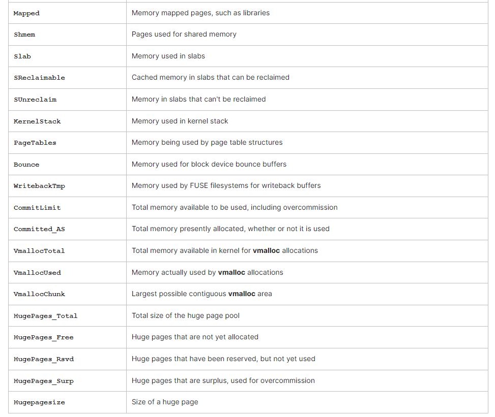
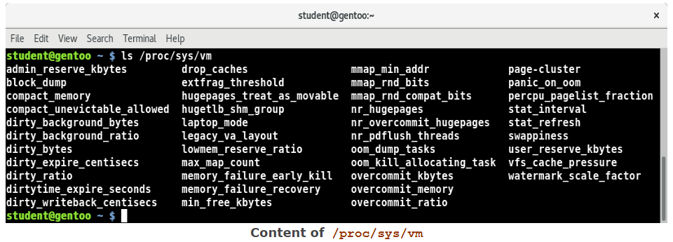
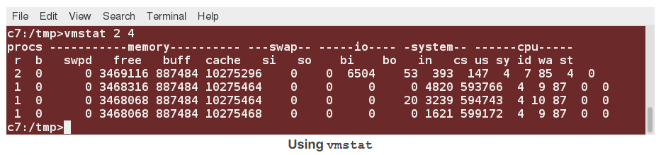
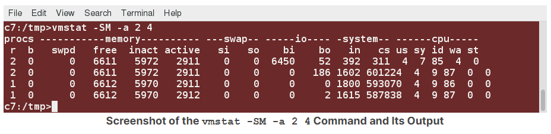
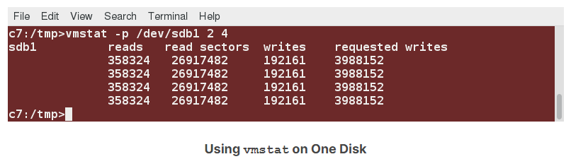
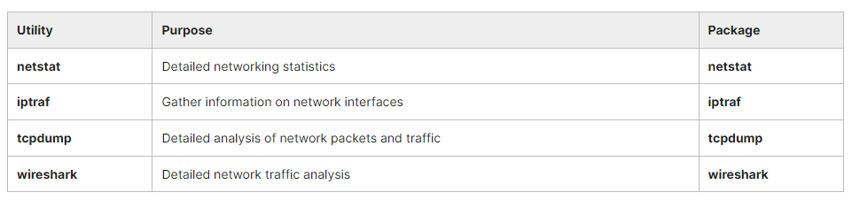

## Chapter 5. Processes and System Monitoring

Monitoring your system is important to make sure it is operating at peak performance, that applications are behaving properly, and that you are not being attacked by some hostile actor that is corrupting the system.

There are many different command line tools which are used for monitoring, and we will tend to use them in this course, though there are graphical tools available. The graphical tools vary quite a bit from Linux distribution to Linux distribution. So, most Linux system administrators concentrate on the command line tools.

- We will look at process monitoring and the two main tools used every day are ‘top’ and ‘ps’.
- We will examine memory usage using programs like ‘free’ and ‘vmstat’.
- Understand the concept of inventory and gain familiarity with available system monitoring tools.
- Understand where the system stores log files and examine the most important ones.
- Use the /proc and /sys pseudo-filesystems.
- Use sar to gather system activity and performance data and create reports that are readable by humans.

## System Monitoring

### Monitoring Tools

While there are a number of graphical system monitors that hide many of the details, we will consider primarily the command line tools in this course.

Linux distributions come with many standard performance and profiling tools already installed. Many of them are familiar from other UNIX-like operating systems while some were developed specifically for Linux.

Most of these tools make use of mounted pseudo-filesystems, especially **/proc** and secondarily **/sys**, both of which we have already discussed when examining filesystems, and will revisit when we take up kernel configuration.

The **/proc** and **/sys** pseudo-filesystems contain a lot of information about the system. Furthermore, many of the entries in these directory trees are writable and can be used to change system behavior; in most cases this requires a root user.

Like **/dev**, these are pseudo-filesystems because they exist totally in memory; if you look at the disk partition when the system is not running there will be only an empty directory which is used as a mount point.

Furthermore, the information displayed is gathered only when it is looked at; there is no constant or periodic polling to update entries.

Graphical system monitors available on all Linux distributions:
- gnome-system-monitor
- ksysguard

**Table: Process and Load Monitoring Utilities**


**Table: Memory Monitoring Utilities**


**Table: I/O Monitoring Utilities**


**Table: Network Monitoring Utilities**


### Log Files

System log files are essential for monitoring and troubleshooting. In Linux, these messages appear in various files under /**var/log**. Exact names vary with Linux distribution.

Ultimate control of how messages are dealt with is controlled by the syslogd (usually rsyslogd on modern systems) daemon, common to many UNIX-like operating systems. The newer systemd-based systems can use journalctl instead, but usually retain syslogd and cooperate with it.

​Important messages are sent not only to the logging files, but also to the system console window; if you are not running a graphical interface or are at a virtual terminal, you will see them directly there as well. In addition, these messages will be copied to **/var/log/messages (on RHEL)** or to **/var/log/syslog (on Ubuntu)**, but if you are running X or Wayland, you have to take some steps to view them as they come in fresh.

- You can view new messages continuously as new lines appear with: ```$ sudo tail -f /var/log/messages```
- Show only kernel-related messages: ```$ dmesg -w```

### Important Log Files

A good way to see log messages is to open a terminal window, and in that window type tail -f /var/log/messages.

On a GNOME desktop, you can also access the messages by clicking on System -> Administration -> System Log or Applications -> System Tools -> Log File Viewer in your Desktop menus. Other desktops have similar links you can locate.

Table: Some important log files found under /var/log


​In order to keep log files from growing without bound, the **logrotate** program is run periodically and keeps four previous copies (by default) of the log files (optionally compressed) and is controlled by **/etc/logrotate.conf**.

### Demo: Available System Monitoring Tools
TODO

## Process

### Process Monitoring Tools

In this section, we will concentrate on process monitoring. To monitor processes, Linux administrators make use of many utilities, such as **ps, pstree and top**, all of which have long histories in UNIX-like operating systems.

Let's review the list of some of the main tools for process monitoring:


The /proc filesystem can also be helpful in monitoring processes, as well as other items, on the system.

### Viewing Process States with 'ps'

**ps** is a workhorse for displaying characteristics and statistics associated with processes, all of which are garnered from the **/proc** directory associated with the process.

Some common choices of options are:
```
$ ps aux
$ ps -elf
$ ps -eL
$ ps -C "bash"
```

This command utility has existed in all UNIX-like operating system variants, and that diversity is reflected in the complicated potpourri of options that the Linux version of ps accepts, which fall into three categories:
- UNIX options, which must be preceded by -, and which may be grouped.
- BSD options, which must not be preceded by -, and which may be grouped.
- GNU long options, each of which must be preceded by --.

Having all these possible options can make life rather confusing. Most system administrators tend to use one or two standard combinations for their daily use.


Image: Using ps with BSD Options

### Customizing the 'ps' Output

If you use the -o option, followed by a comma-separated list of field identifiers, you can print out a customized list of ps fields:
- pid: Process ID number
- uid: User ID number
- cmd: Command with all arguments
- cputime: Cumulative CPU time
- pmem: Ratio of the process's resident set size to the physical memory on the machine, expressed as a percentage.

You can consult the ps man page for many other output options.


Another common options choice is -elf:


### Using 'pstree'

**pstree** gives a visual description of the process ancestry and multi-threaded applications, showing the user the relationships between parent-child processes: 
```
$ pstree -aAp 2408
bash,2408
|-emacs,24998 pmonitor.tex
|   |-{emacs},25002
|   `-{emacs},25003
|-evince,18036 LFD108-SLIDES.pdf
|   |-{evince},18040
|   |-{evince},18046
|   `-{evince},18047
```

Note that one of its child processes (evince, pid=18036) has three children of its own. Another way to see that is:

```
$ ls -l /proc/18036/task

total 0
dr-xr-xr-x 5 coop coop 0 Sep 11 07:15 18036
dr-xr-xr-x 5 coop coop 0 Sep 11 07:15 18040
dr-xr-xr-x 5 coop coop 0 Sep 11 07:15 18046
dr-xr-xr-x 5 coop coop 0 Sep 11 07:15 18047
```

Consult the man page for pstree for an explanation of many options; in the above we have chosen just to show information for pid=2408.

You can use -p to show process IDs, and -H [pid] to highlight [pid] and its ancestors.
```
$ pstree -aAps 31478
systemd,1 --switched-root --system --deserialize 21
  `-vmplayer, 31478
      |-{vmplayer},31570
      |-{vmplayer},31593
      |-{vmplayer},32752
      `-{vmplayer}32698
```

### Using 'top'

top is used to display processes with the highest CPU usage. Processes are initially sorted by CPU usage.

If not run in secure mode (top s), the user can signal processes:
- Press the k key
- Give a PID when prompted
- Give a signal number when prompted.

top is an ancient utility and has a ton of options, as well as interactive commands triggered when certain keys are pressed.

For example, hit the h key to get a list of key bindings. The display may be sorted by a number of different criteria. The display is refreshed every 5 seconds (though this is configurable) and continues to run until the user interrupts it (Ctrl-C).


### More on '/proc'

The /proc filesystem is an interface to the kernel data structures. **/proc** contains a subdirectory for each active process, named by the process id (PID). **/proc/self** is the currently executing process. Some tunable parameters are in the /proc directories. For more info, see the proc man page.

In the sample output below, notice the sub-directories of the /proc filesystem which have numeric values for names. These ASCII numeric strings represent the PIDs of all active processes on the system. Each subdirectory contains additional files with information about that process.


### Background and Foreground Processes

Processes run in the foreground by default. Adding an ampersand **(&)** after a command will run the command in the background: ```$ updatedb &```

Using Ctrl-Z, you can suspend a foreground process. The **bg** command makes it run in the background. The **fg** command puts it back in the foreground. **Ctrl-C** terminates a foreground process.

Foreground jobs run from the shell, making access to the shell wait until the job has finished. This may not be a problem, but if the job will takes a long time to complete, putting it in the background frees up the shell for further interactive work. The background job will run at a lower priority allowing interactive work to go smoothly. You can also log off the terminal window without affecting the background job.
```
$ update &
[1] 22209

$ sleep 100
^Z
[2]+ Stopped   sleep 100

$ bg
[2]+ sleep 100 &

$ fg
sleep 100
^Z
[2]+ Stopped   sleep 100

$ bg
[2]+ sleep 100

$ fg
sleep 100
^C
```

### Managing Jobs

The jobs command shows the background processes in the current terminal: it shows the job ID, the state and the command name. The job ID can be used with **bg** and **fg**.

```
$ jobs
1 - Running   updatedb &
2 + Stopped   sleep 10
```

The following command:```$ jobs -l``` will provide the PID for the job.

The background jobs are still somewhat connected to the terminal window in that, if you log off, jobs will no longer show the jobs started from that window.

### Using 'at' to Start in the Future

The **at** command executes any non-interactive command at a specified time. For example, to start executing a command after a delay, run:
```
$ at now + 2 days
at> mail < /var/log/messages admin@example.com
at> <EOT>
job 1 at 2013-01-16 13:24
```

By entering at with the future time, the interactive part of **at** will start. At the prompt, enter in the command to run, hit enter, then **Ctrl-d** to exit. You then use **atq** to see the job information.

### Using 'cron'

**cron** is a very useful and flexible tool. It is used for any job that needs to run on a regular schedule (e.g., backups). It can be managed in different ways:
- crontab lets users specify jobs
- /etc/cron.d/ can be extended with formatted job files
- /etc/cron.{hourly,daily,weekly,monthly} can obtain any system script

Tasks can be queued to run every hour, every day, once a week or once a month, or even every 10 seconds. Mail will be sent when a job has completed or failed.
```
$ ls -l /etc/cron.d
total 16
-rw-r--r-- 1 root root 128 Mar 29  2017 0hourly
-rw-r--r-- 1 root root  78 Dec 29 09:24 atop
-rw-r--r-- 1 root root 108 Jun 13  2017 raid-check
-rw------- 1 root root 235 Mar 29  2017 sysstat
```

```
$ ls -l /etc/cron.d.daily
total 68
-rwxr-xr-x 1 root root   302 Mar  7 08:55 docker-latest-logrotate
-rwxr-xr-x 1 root root 18812 Mar 20 00:01 google-chrome
-rwxr-xr-x 1 root root     1 Jan     2017 google-earth
lrwxrwxrwx 1 root root    45 Jun 16  2016 google-talkplugin -> /opt/google/talkplugin/cron/google-talkplugin
-rwx------ 1 root root   219 Jan 24  2017 logrotate
-rwxr-xr-x 1 root root   618 Mar 17  2014 man-db.cron
-rwx------ 1 root root   208 Feb  4  2016 mlocate
-rwxr-x--- 1 root root  2126 Aug 17  2016 prelink
-rwx------ 1 root root   256 Sep  1  2017 rhsmd
-rwxrwxr-x 1 root root 18775 Mar  5 13:55 slack
```

While cron has been used in UNIX-like operating systems for decades, modern Linux distributions have moved over to **anacron**, which will be explained shortly.

### Using 'anacron'

On older Linux systems, **crontab** contained information about when to run the jobs in the **/etc/cron.*** subdirectories. However, it was implicitly assumed the machine was always running. If the machine was powered off, scheduled jobs would not run.

**anacron** has replaced **cron** on modern systems. anacron will run the necessary jobs in a controlled and staggered manner when the system is running. The key configuration file is **/etc/anacrontab**.

You can see an example of an anacron configuration file below:

```
# /etc/anacrontab: configuration file for anacron

# See anacron(8) and anacrontab(5) for details.

SHELL=/bin/sh
PATH=/sbin:/bin:/usr/sbin:/usr/bin
MAILTO=root
# the maximal random delay added to the base delay of the jobs
RANDOM_DELAY=45
# the jobs will be started during the following hours only
START_HOURS_RANGE=3-22

#period in days delay in minutes job-identifier command
1          5  cron.daily    nice run-parts /etc/cron.daily
7         25  cron.weekly   nice run-parts /etc/cron.weekly
@monthly  45  cron.monthly  nice run-parts /etc/cron.monthly
```

### Sleeping

**sleep** can be used in shell scripts, as well, for example, as a reminder every 10 minutes that a meeting time is approaching.

The sleep command can be used to easily delay commands:```$ (sleep 600; launchbackup.sh) &```

## Memory Monitoring and Tuning

### Memory Monitoring

Over time, systems have become more demanding of memory resources and at the same time RAM prices have decreased and performance has improved.

Yet, it is often the case that bottlenecks in overall system performance and throughput are memory-related; the CPUs and the I/O subsystem can be waiting for data to be retrieved from or written to memory.

There are many tools for monitoring, debugging and tuning a system’s behavior with regard to its memory.

Tuning the memory sub-system can be a complex process. First of all, one has to take note that memory usage and I/O throughput are intrinsically related, as, in most cases, most memory is being used to cache the contents of files on disk.

Thus, changing memory parameters can have a large effect on I/O performance, and changing I/O parameters can have an equally large converse effect on the virtual memory sub-system.




### '/proc/meminfo'

The pseudofile **/proc/meminfo** contains a wealth of information about how memory is being used.

```
$ cat /proc/meminfo

MemTotal:      16265960 kB
MemFree:       10481080 kB
MemAvailable:  12596456 kB
Buffers:         177824 kB
Cached:         2768600 kB
SwapCached:           0 kB
Active:         3320564 kB
Inactive:       1566504 kB
Active(anon):   2381096 kB
Inactive(anon):  218792 kB
Active(file):    939468 kB
Inactive(file): 1347712 kB
Unevictable:     437372 kB
Mlocked:             32 kB
SwapTotal:     21580796 kB
SwapFree:      21580796 kB
Dirty:              288 kB
Writeback:            0 kB
AnonPages:      2248272 kB
Mapped:          811700 kB
Shmem:           659452 kB
KReclaimable:    159792 kB
Slab:            307548 kB
SReclaimable:    159792 kB
SUnreclaim:      147756 kB
KernelStack:      15680 kB
PageTables:       74940 kB
NFS_Unstable:         0 kB
Bounce:               0 kB
WritebackTmp:         0 kB
CommitLimit:   29713776 kB
Committed_AS:  10239968 kB
VmallocTotal:  34359738367 kB
VmallocUsed:      24592 kB
VmallocChunk:         0 kB
Percpu:            6688 kB
HardwareCorrupted:    0 kB
AnonHugePages:   716800 kB
ShmemHugePages:       0 kB
ShmemPmdMapped:       0 kB
FileHugePages:        0 kB
FilePmdMapped:        0 kB
HugePages_Total:      0
HugePages_Free:       0
HugePages_Rsvd:       0
HugePages_Surp:       0
Hugepagesize:      2048 kB
Hugetlb:              0 kB 
DirectMap4k:     258124 kB
DirectMap2M:    9052160 kB
DirectMap1G:    8388608 kB
```

It is worthwhile to go through this listing and understand most of the entries, listed in the table below.

Table: /proc/meminfo Entries



Note that the exact entries you may see will depend on the exact kernel version you are running.

### '/proc/sys/vm'

The /proc/sys/vm directory contains many tunable knobs to control the Virtual Memory system. Exactly what appears in this directory will depend somewhat on the kernel version. Almost all of the entries are writable (by root).

Remember that these values can be changed either by directly writing to the entry, or using the sysctl utility.

When tweaking parameters in /proc/sys/vm, the usual best practice is to adjust one thing at a time and look for effects. The primary (inter-related) tasks are: 
- Controlling flushing parameters; i.e., how many pages are allowed to be dirty and how often they are flushed out to disk.
- Controlling swap behavior; i.e., how much pages that reflect file contents are allowed to remain in memory, as opposed to those that need to be swapped out as they have no other backing store. 
- Controlling how much memory overcommission is allowed, since many programs never need the full amount of memory they request, particularly because of copy on write (COW) techniques. 

Memory tuning can be subtle: what works in one system situation or load may be far from optimal in other circumstances.


### Using 'vmstat'

**vmstat** is a multi-purpose tool that displays information about memory, paging, I/O, processor activity and processes. It has many options. The general form of the command is: ```$ vmstat [options] [delay] [count]```

If delay is given in seconds, the report is repeated at that interval count times; if count is not given, **vmstat** will keep reporting statistics forever, until it is killed by a signal, such as Ctrl-C.

If no other arguments are given, you can see what vmstat displays, where the first line shows averages since the last reboot, while succeeding lines show activity during the specified interval.

```$ vmstat 2 4```


If the option **-S m** is given, memory statistics will be in MB instead of KB.

With the **-a** option, **vmstat** displays information about active and inactive memory, where active memory pages are those which have been recently used; they may be clean (disk contents are up to date) or dirty (need to be flushed to disk eventually). By contrast, inactive memory pages have not been recently used and are more likely to be clean and are released sooner under memory pressure:

```$ vmstat -a 2 4```
Memory can move back and forth between active and inactive lists, as they get newly referenced, or go a long time between uses.


If you just want to get some quick statistics on only one partition, use the **-p** option:


### OOM Killer

Systems may run out of physical memory. You can:
- Deny any further memory requests until memory is freed up
- Extend physical memory by the use of swap space
- Terminate (intelligently) selected processes to reduce memory usage and let the system survive.

Linux systems most often implement the second and third methods. The Out of Memory (OOM) Killer is the one selecting which processes are terminated.

The simplest way to deal with memory pressure would be to permit memory allocations to succeed as long as free memory is available and then fail when all memory is exhausted.

The second simplest way is to use swap space on disk to push some of the resident memory out of core; in this case, the total available memory (at least in theory) is the actual RAM plus the size of the swap space. The hard part of this is to figure out which pages of memory to swap out when pressure demands. In this approach, once the swap space itself is filled, requests for new memory must fail.

Linux, however, goes one better; it permits the system to overcommit memory, so that it can grant memory requests that exceed the size of RAM plus swap. While this might seem foolhardy, many (if not most) processes do not use all requested memory.

An example would be a program that allocates a 1 MB buffer, and then uses only a few pages of the memory. Another example is that every time a child process is forked, it receives a copy of the entire memory space of the parent. Because Linux uses the COW (copy on write) technique, unless one of the processes modifies memory, no actual copy needs be made. However, the kernel has to assume that the copy might need to be done.

Thus, the kernel permits overcommission of memory, but only for pages dedicated to user processes; pages used within the kernel are not swappable and are always allocated at request time.

### OOM Killer Algorithms

You can modify, and even turn off this overcommission by setting the value of **/proc/sys/vm/overcommit_memory**:
- 0: (default) Permit overcommission, but refuse obvious overcommits, and give root users somewhat more memory allocation than normal users.
- 1: All memory requests are allowed to overcommit.
- 2: Turn off overcommission. Memory requests will fail when the total memory commit reaches the size of the swap space plus a configurable percentage (50 by default) of RAM. This factor is modified changing **/proc/sys/vm/overcommit_ratio**.

If available memory is exhausted, Linux invokes the OOM-killer (Out Of Memory) to decide which process(es) should be exterminated to open up some memory.

There is no precise science for this; the algorithm must be heuristic and cannot satisfy everyone. In the minds of many developers, the purpose of the OOM-killer is to permit a graceful shutdown, rather than be a part of normal operations.

An amusing take on this was given by [Andries Brouwer](https://lwn.net/Articles/104185/):


In order to make decisions of who gets sacrificed to keep the system alive, a value called the **badness** is computed (which can be read from **/proc/[pid]/oom_score**) for each process on the system and the order of the killing is determined by this value.

Two entries in the same directory can be used to promote or demote the likelihood of extermination. The value of **oom_adj** is the number of bits the points should be adjusted by. Normal users can only increase the badness; a decrease (a negative value for **oom_adj**) can only be specified by a superuser. The value of **oom_adj_score** directly adjusts the point value. Note that the use of **oom_adj** is deprecated.

## Network Monitoring

### Network Monitoring Tools



## Lab Exercises

### Lab 5.1. Getting Uptime and Load Average

To gain insight into your system's performance, complete the following two tasks:
- Ascertain how long your system has been up.
- Display the load average.

A very simple method is just to use the uptime utility:

$ uptime

10:26:40 up 3:19, 5 users, load average: 1.46, 1.40, 1.19

A second method is to look at the first line of output from top:

$ top | head

top - 10:28:11 up  3:20,  5 users,  load average: 1.93, 1.52, 1.25
Tasks: 313 total,   1 running, 312 sleeping,   0 stopped,   0 zombie
%Cpu(s):  1.0 us,  0.3 sy,  0.0 ni, 98.2 id,  0.5 wa,  0.0 hi,  0.0  si, 0.0
KiB Mem : 16284472 total,  6556792 free, 1029760 used,  8697920 buff/cache
KiB Swap:  8290300 total,  8290300 free,       0 used. 10364220 avail Mem

  PID USER     PR  NI   VIRT     RES    SHR S  %CPU %MEM    TIME+ COMMAND
 2615 coop     20  0  504536  186312  65488 S   6.7  1.1  6:28.30 skype-b+
18248 coop     20  0  655804   50816  30884 S   6.7  0.3  0:20.11 emacs
    1 root     20  0  204912    6508   3956 S   0.0  0.0  0:00.92 systemd

A third method is to use w:

10:30:51 up 3:23, 5 users, load average: 0.55, 1.11, 1.14
USER     TTY    FROM            LOGIN@   IDLE   JCPU  PCPU WHAT
coop     :0     :0              07:08   ?xdm?  16:51  0.19s gdm-session-
coop     pts/0  :0              07:09    2:22m  0.12s 0.12s bash
coop     pts/1  :0              07:09    1:37m  0.42s 0.42s bash
coop     pts/2  :0              07:09    0.00s 51.09s 0.00s w
coop     pts/3  :0              07:09   27:08   0.25s 0.25s bash

### Lab 5.2. Background and Foreground Jobs

We are going to launch a graphical program from a terminal window, so that one can no longer type in the window. We are going to launch a graphical program from a terminal window, so that one can no longer type in the window. gedit is an easy choice but you can substitute any other program that does this.

Open gedit on a new file as in:
$ gedit somefile
You can no longer type in the terminal window.
While your pointer is over the terminal window, hit CTRL-Z.
ˆZ
[3]+   Stopped            gedit somefile
You can no longer type in the gedit window.
With jobs -l, see what processes have been launched from this terminal window:
$ jobs -l
[1]  17705 Running              evince *pdf &
[2]- 18248 Running              emacs /tmp/hello.tex &
[3]+ 19827 Stopped              gedit somefile
Now put the most recent job (gedit somefile) in background:
$ bg
[3]+ gedit somefile &
Now you should be able to type in the gedit window.
Put the process in foreground again:
$ fg
gedit somefile
Note you can no longer type in the terminal window.
To clean up, suspend the process again and then use kill to terminate it:
ˆZ
[3]+ Stopped              gedit somefile

$ jobs -l
[1]  17705 Running              evince *pdf &
[2]- 18248 Running              emacs /tmp/hello.tex &
[3]+ 19827 Stopped              gedit somefile

$ kill -9 19827
$ jobs -l
[1]  17705 Running              evince *pdf &
[2]- 18248 Running              emacs /tmp/hello.tex &
[3]+ 19827 Killed               gedit somefile

$ jobs -l
[1]- 17705 Running              evince *pdf &
[2]- 18248 Running              emacs /tmp/hello.tex &

### Lab 5.3. Using 'at' for Batch Processing in the Future

Schedule a very simple task to run at a future time from now.

This can be as simple as running ls or date and saving the output. (You can use a time as short as one minute in the future.)

Note that the command will run in the directory from which you schedule it with at.

Do this:
- From a short bash script
- Interactively


1. Create the file testat.sh containing:

#!/bin/bash
date > /tmp/datestamp

And then make it executable and queue it up with at:

$ chmod +x testat.sh
$ at now + 1 minute -f testat.sh

You can see if the job is queued up to run with atq:
$ atq
17        Wed Apr 22 08:55:00 2015 a student

Make sure the job actually ran:
$ cat /tmp/datestamp
Wed Apr 22 08:55:00 CDT 2015

What happens if you take the >/tmp/datestamp out of the command? (Hint: type mail if not prompted to do so!)

2. Interactively it is basically the same procedure. Just queue up the job with:

$ at now + 1 minute
at> date > /tmp/datestamp
CTRL-D
$ atq

### Lab 5.4. Scheduling a Periodic Task with 'cron'

Set up a cron job to do some simple task every day at 10 AM.

Create a file named mycrontab with the following content:

0 10 * * * /tmp/myjob.sh

Then create /tmp/myjob.sh containing:

#!/bin/bash
echo Hello I am running $0 at $(date)

Make it executable:

$ chmod +x /tmp/myjob.sh

Put it in the crontab system with:

$ crontab mycrontab

Verify it was loaded with:

$ crontab -l
0 10 * * * /tmp/myjob.sh

$ sudo ls -l /var/spool/cron/student
-rw------- 1 student student 25 Apr 22 09:59 /var/spool/cron/student

$ sudo cat /var/spool/cron/student
0 10 * * * /tmp/myjob.sh

Note: If you don't really want this running every day, printing out messages like:

Hello I am running /tmp/myjob.sh at Wed Apr 22 10:03:48 CDT 2015

and mailing them to you, you can remove it with:

$ crontab -r

If the machine is not up at 10 AM on a given day, anacron will run the job at a suitable time.

### Lab 5.5. Using 'stress' or 'stress-ng'

stress is a C language program written by Amos Waterland at the University of Oklahoma, licensed under the GPL v2. It is designed to place a configurable amount of stress by generating various kinds of workloads on the system.

stress-ng is essentially an enhanced version of stress, which respects its symptoms and options. It is actively maintained: see the [ubuntu wiki](https://wiki.ubuntu.com/Kernel/Reference/stress-ng).

All major distributions should have stress-ng in their packaging systems However, for RHEL/CentOS it needs to be obtained from the EPEL repository. As of this writing, there is no package in the EPEL 8 repository, but you can install the one from EPEL 7 without a problem.

Installing from Source: If you are lucky, you can install stress or stress-ng directly from your distribution’s packaging system. Otherwise, the source for stress-ng can be obtained using git. (Or you can download a tarball and use that.) To download, compile, and install:

$ git clone git://kernel.ubuntu.com/cking/stress-ng.git
$ cd stress-ng
$ make
$ sudo make install

Once installed, you can do $ stress-ng --help for a quick list of options or $ info stress-ng for more detailed documentation.

As an example, the command $ stress-ng -c 8 -i 4 -m 6 -t 20s will do the following:
- Fork off 8 CPU-intensive processes, each spinning on a sqrt() calculation.
- Fork off 4 I/O-intensive processes, each spinning on sync().
- Fork off 6 memory-intensive processes, each spinning on malloc(), allocating 256 MB by default. The size can be changed as in --vm-bytes 128M.
- Run the stress test for 20 seconds.

After installing stress-ng, you may want to start up your system’s graphical system monitor, which you can find on your application menu, or run from the command line, which is probably gnome-system-monitor or ksysguard.

Now begin to put stress on the system. The exact numbers you use will depend on your system’s resources, such as the number of CPU’s and RAM size.

For example, doing  $ stress-ng -m 4 -t 20s puts only a memory stressor on the system.

Play with combinations of the switches and see how they impact each other. You may find the stress-ng program useful to simulate various high load conditions.

### Lab 5.6. Processes

1. Run ps with the options -ef. Then run it again with the options aux. Note the differences in the output.
2. Run ps so that only the process ID, priority, nice value, and the process command line are displayed.
3. Start a new bash session by typing bash at the command line. Start another bash session using the nice command, but this time giving it a nice value of 10.
4. Run ps as in step 2 to note the differences in priority and nice values. Note the process ID of the two bash sessions.
Change the nice value of one of the bash sessions to 15 using renice. Once again, observe the change in priority and nice values.
5. Run top and watch the output as it changes. Hit q to stop the program.

```
1)
$ ps -ef
$ ps aux

2)
$ ps -o pid,pri,ni,cmd
  PID PRI NI CMD
 2389  19  0 bash
22079  19  0 ps -o pid,pri,ni,cmd
(Note: There should be no spaces between parameters.)

3)
$ bash
$ nice -n 10 bash
$ ps -o pid,pri,ni,cmd
 2389 19  0 bash
22115 19  0 bash
22171  9 10 bash
22227  9 10 ps -o pid,pri,ni,cmd

4)
$ renice 15 -p 22171
$ ps -o pid,pri,ni,cmd
 PID PRI NI CMD
 2389 19  0 bash
22115 19  0 bash
22171  4 15 bash
22246  4 15 ps -o pid,pri,ni,cmd

5)
$ top
```

### Lab 5.7. Monitoring Process States

1. Use dd to start a background process which reads from /dev/urandom and writes to /dev/null.
2. Check the process state. What should it be?
3. Bring the process to the foreground using the fg command. Then hit Ctrl-Z. What does this do? Look at the process state again, what is it?
4. Run the jobs program. What does it tell you?
5. Bring the job back to the foreground, then terminate it using kill from another window.

```
1) 
$ dd if=/dev/urandom of=/dev/null &

2)
$ ps -C dd -o pid,cmd,stat
25899 dd if=/dev/urandom of=/dev/ R
Should be S or R.

3) 
$ fg
$ ˆZ
$ ps -C dd -o pid,cmd,stat
  PID CMD                         STAT
25899 dd if=/dev/urandom of=/dev/ T
State should be T.

4)
Type the jobs command. What does it tell you?
$ jobs
[1]+ Stopped                  dd if=/dev/urandom of=/dev/null

5)
Bring the job back to the foreground, then kill it using the kill command from another window.
$ fg
$ kill 25899
```

### Lab 5.8. Invoking the OOM Killer

Examine what swap partitions and files are present on your system by examining /proc/swaps.

Turn off all swap with the command:

$ sudo /sbin/swapoff -a

Make sure you turn it back on later, when we are done, with:

$ sudo /sbin/swapon -a

Now we are going to put the system under increasing memory pressure. One way to do this is to exploit the stress-ng program we installed earlier, running it with arguments such as:

$ stress-ng -m 12 -t 10s

which would keep 3 GB busy for 10 seconds.

You should see the OOM (Out of Memory) killer swoop in and try to kill processes in a struggle to stay alive. You can see what is going on by running dmesg, monitoring /var/log/messages, /var/log/syslog, or through graphical interfaces that expose the system logs.

Who gets clobbered first?

