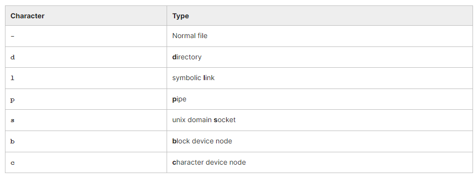

## Chapter 6. Files and Filesystems

By the end of this section, you should be able to:
- Enumerate the different kinds of files and file-like objects on the system.
- Use the file program to investigate file types.
- Set permissions and access rights on files and directories using **chmod**.
- Change ownership using **chown**.
- Use **umask**.

## Files and Filesystems

### Types of Files

There is a limited number of basic file types, each of which are displayed in the following directory listing:

```
​$ ls -lF

total 8
brw-r--r-- 1 coop coop 200, 0 Mar 9 15:07 a_block_device_node
crw-r--r-- 1 coop coop 200, 0 Mar 9 15:06 a_character_device_node
drwxrwxr-x 2 coop coop 4096   Mar 9 15:05 a_directory/
prw-rw-r-- 1 coop coop 0      Mar 9 15:04 a_fifo|
-rw-rw-r-- 1 coop coop 1601   Mar 9 15:04 a_file
lrwxrwxrwx 1 coop coop 4      Mar 9 15:06 a_symbolic_link_to_a_directory -> /usr/
lrwxrwxrwx 1 coop coop 6      Mar 9 15:10 a_symbolic_link_to_a_file -> a_file
srwxrwxr-x 1 coop coop 0      Mar 9 15:09 mysock=
```

The first character in the listing shows the type of file:


Normal files and directories are the basic entries in the filesystem structure.

Symbolic links point somewhere else on the system, such that a reference to either the link or its target is equivalent.

Named pipes (also called FIFOs, for First In, First Out) are used for inter-process communication.

Unix domain sockets are used for a similar purpose, but do this through networking infrastructure, and have some more capabilities than FIFOs.

Device nodes are used to communicate with either hardware devices or software pseudo-devices.
- **Block devices**
They read and write in pre-determined fixed size chunks, and usually correspond to storage media such as disks and CD-ROMs. The I/O is generally buffered and cached.
- **Character devices**
They are addressed with streams of data, and correspond to devices such as sound cards, serial ports, etc. The I/O is generally not buffered or cached.

Device nodes are almost always placed in the **/dev** directory.

In describing UNIX-like operating systems, such as Linux, one often hears the old saying: Everything is a file. This fits in with the philosophy that the same basic tools can be used for a wide variety of purposes, whether you are dealing with normal files, devices, etc., and can be strung together to accomplish non-trivial tasks. There are exceptions to this model. For example, network devices in Linux have no corresponding filesystem entry.

Note that in Linux file extensions rarely play a defining role. The file type is determined by examining its contents rather than its extension.

The file utility program can be used to ascertain file types, as in:

```
$ file *

addkernel.sh:                   Bourne-Again shell script, ASCII text executable
airplane.sh:                    Bourne-Again shell script, ASCII text executable
atob:                           C shell script, ASCII text executable
avconv:                         ELF 64-bit LSB executable, x86-64, version 1 (SYSV), dynamically linked, interpreter /lib64/ld-linux-x86-64.so.2,
                                for GNU/Linux 2.6.32, BuildID[sha1]=696c7046995b342bf1ae93adc0662fd76cee1dc5, with debug_info, not stripped
avprobe:                        ELF 64-bit LSB executable, x86-64, version 1 (SYSV), dynamically linked, interpreter /lib64/ld-linux-x86-64.so.2,
                                for GNU/Linux 2.6.32, BuildID[sha1]=59aa02b8718f4e6ce77ae36ae40a4c2b2a88621d, with debug_info, not stripped
awkit.sh:                       Bourne-Again shell script, ASCII text executable
aws:                            Python script, ASCII text executable
....
blank.jpg:                      JPEG image data, JFIF standard 1.01, resolution (DPI), density 95x95, segment length 16, progressive, precision 8, 570x450, frames 1
.....
cgcc:                           Perl script text executable
```

### Permissions and Access Rights

When you do **ls -l** as in:

```
$ ls -l a_file
-rw-rw-r-- 1 coop aproject 1601 Mar 9 15:04 a_file
```

after the first character, there are nine more which indicate the access rights granted to potential file users. These are arranged in three groups of three:
- **owner**: the user who owns the file; also called user
- **group**: the group of users who have access
- **world**: the rest of the world; also called other.
In the above listing, the user is coop and the group is aproject.

Each of the triplets can have each of the following values set:​
- **r**: read access is allowed
- **w**: write access is allowed
- **x**: execute access is allowed.
If the permission is not allowed, a "-" appears instead of one of these characters.

Thus, in the preceding example, the user **coop** and members of the group **aproject** have read and write access, while anyone else has only read access.

### Changing Permissions and Ownership

Changing file permissions is done with **chmod**, while changing file ownership is done with **chown**, and changing the group is done with **chgrp**.

There are a number of different ways to use chmod. For instance, to give the owner and world execute permission, and remove the group write permission:

```
$ ls -l a_file
-rw-rw-r-- 1 coop coop 1601 Mar 9 15:04 a_file

$ chmod uo+x,g-w a_file
$ ls -l a_file

-rwxr--r-x 1 coop coop 1601 Mar 9 15:04 a_file
where u stands for user (owner), o stands for other (world), and g stands for group.
```

This kind of syntax can be difficult to type and remember, so one often uses a shorthand which lets you set all the permissions in one step. This is done with a simple algorithm, and a single digit suffices to specify all three permission bits for each entity. This digit is the sum of:
- **4** if read permission is desired
- **2** if write permission is desired
- **1** if execute permission is desired.
Thus **7** means read/write/execute, **6** means read/write, and **5** means read/execute.

When you apply this when using chmod, you have to give three digits for each degree of freedom, such as in:
```
$ chmod 755 a_file
$ ls -l a_file

-rwxr-xr-x 1 coop coop 1601 Mar 9 15:04 a_file
```

Changing the group ownership of the file is as simple as doing: ```$ chgrp aproject a_file```
changing the ownership is as simple as: ```$ chown coop a_file```
You can change both at the same time with: ```$ chown coop.aproject a_file```
**where you separate the owner and the group with a period.**

All three of these commands can take an **-R** option, which stands for recursive. For example:
```
$ chown -R coop.aproject .
$ chown -R coop.aproject subdir
```
will change the owner and group of all files in the current directory and all its subdirectories in the first command and in subdir, and all its subdirectories in the second command.

These commands can only do what you already have the right to do. For example, you cannot change the permissions on a file you do not own, or switch to a group you are not a member of. To do such changes, you must be root, prefixing **sudo** to most of the above commands.

### Demo using umask
TODO

## Lab Exercises

### Lab 6.1. 'umask'

Create an empty file with:
```
$ touch afile
$ ls -l afile
-rw-rw-r-- 1 coop coop 0 Jul 26 12:43 afile
```
This shows it is created by default with read/write permissions for owner and group, and read for world.

In fact, the default permissions given when creating a file is actually read/write for owner, group and world (0666); it has been modified by the current umask.

If you just type **umask** you get the current value:

```
$ umask
0002
```

This is the most conventional value set by system administrators for users. This value is combined with the file creation permissions to get the actual result; i.e., ```0666 & ˜002 = 0664; i.e., rw-rw-r–```

Try modifying the umask and creating new files and see the resulting permissions as in:
```
$ umask 0022
$ touch afile2
$ umask 0666
$ touch afile3
$ ls -l afile*
```

### Lab 6.2. Using 'chmod'

While we have shown you have to use **chmod** using the octal digit method of specifying permissions, it is usually preferable to use the symbolic methods that we will show here.

It is possible to either give the permissions directly or add or subtract permissions. The syntax is pretty obvious.

Here are some examples:
```
$ chmod u=r,g=w,o=x afile
$ chmod u=+w,g=-w,o=+rw afile
$ chmod ug=rwx,o=-rw afile
```

After each step do: ```$ ls -l afile``` to see how the permissions took, and try some variations.

### Lab 6.3. 'setuid'

Normally, programs are run with the privileges of the user who is executing the program. Occasionally it may make sense to have normal users have expanded capabilities they would not normally have, such as the ability to start or stop a network interface or edit a file owned by the superuser.

By setting the **setuid (set user ID)** flag on an executable file one modifies this normal behavior by giving the program the access rights of the **owner** rather than the **user** of the program.

We should emphasize that this is generally a bad idea and is to be avoided in most circumstances. Writing a **daemon** program with lesser privileges for this kind of use is often better.

Suppose we have the following C program **(./writeit.c)** which attempts to overwrite a file in the current directory, afile:

```
1 #include <stdio.h>
2 #include <unistd.h>
3 #include <fcntl.h>
4 #include <stdlib.h>
5 #include <string.h>
6 #include <stdlib.h>
7 #include <sys/stat.h>
8
9 int main(int argc, char *argv[])
10 {
11         int fd, rc;
12         char *buffer = "TESTING A WRITE";
13
14         fd = open("./afile", O_RDWR | O_CREAT | O_TRUNC, S_IRUSR | S_IWUSR);
15         rc = write(fd, buffer, strlen(buffer));
16         printf("wrote %d bytes\n", rc);
17         close(fd);
18         exit(EXIT_SUCCESS);
19 }
```

This can be compiled simply by doing: ```$ make writeit (or) $ gcc -o writeit writeit.c```

If you try to run this program on a file owned by root, you will get the following sequence of events:
```
$ sudo touch afile
$ ./writeit afile
wrote -1 bytes
```

```
$ sudo ./writeit afile
wrote 15 bytes
```

Thus, the root user was able to overwrite the file it owned, but a normal user could not.

Observe that changing the owner of writeit to root will not help:
```
$ sudo chown root.root writeit
$ ./writeit
wrote -1 bytes
```

By setting the setuid bit you can make any normal user able to do this:
```
$ sudo chmod +s writeit
$ ./writeit
wrote 15 bytes
```

You may be asking, why did not we just write a script to do such an operation, rather than to write and compile an executable program? The reason is that under Linux, if you change the setuid bit on such an executable, it will not do anything unless you actually change the setuid bit on the shell.

Solution:
```
#include <stdio.h>
#include <unistd.h>
#include <fcntl.h>
#include <stdlib.h>
#include <string.h>
#include <stdlib.h>
#include <sys/stat.h>

int main(int argc, char *argv[])
{

        int fd, rc;
        char *buffer = "TESTING A WRITE";

        fd = open("./afile", O_RDWR | O_CREAT | O_TRUNC, S_IRUSR | S_IWUSR);
        rc = write(fd, buffer, strlen(buffer));
        printf("wrote %d bytes\n", rc);
        close(fd);
        exit(EXIT_SUCCESS);
}
```

You can download a script with the above steps from **s_06/lab_write.c**.
