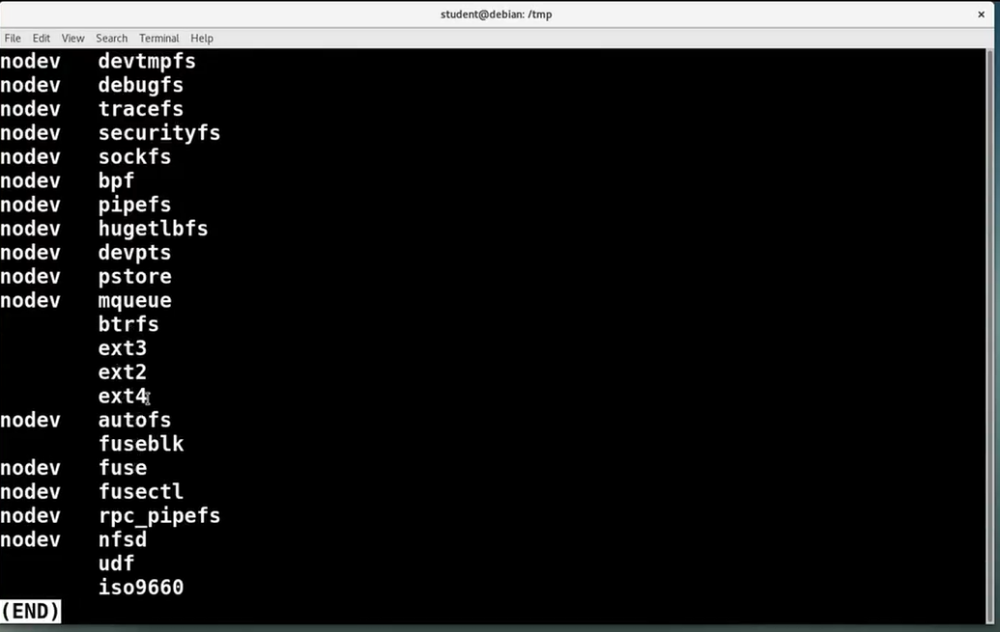
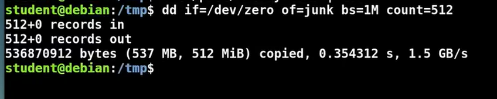
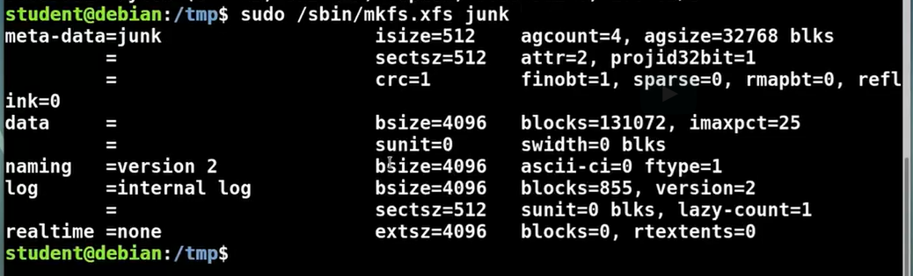
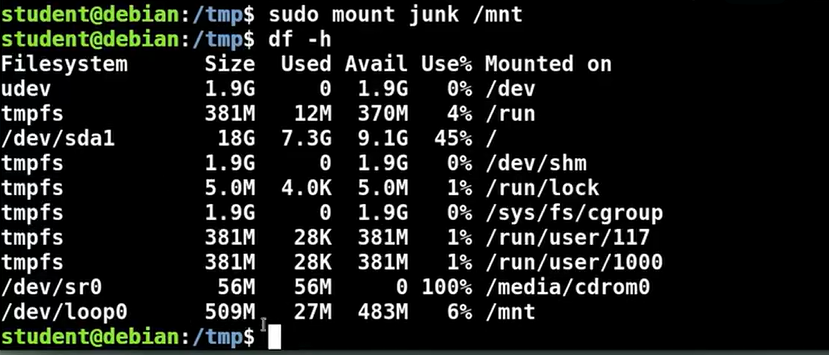
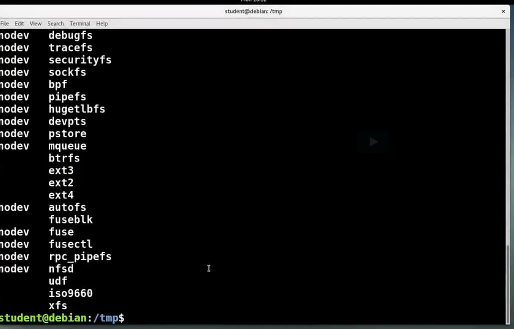
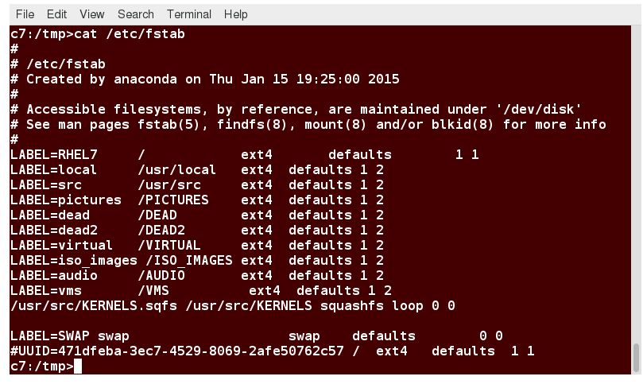

## Chapter 7. Linux Filesystems

- Understand the role of the virtual filesystem (VFS) and how Linux uses it to deploy a vast array of choices.
- Understand the native Linux filesystems in the ext(2,3,4) family.
- List and understand the available journaling filesystems, including ext3, ext4, xfs, jfs, and btrfs.
- Mount filesystems at any time or at boot.
- Understand the use of Redundant Array of Independent Disks (RAID) and logical volume management (LVM).

## Linux Filesystems

### Filesystems and the VFS

Linux implements a **Virtual File System (VFS)**, as do all modern operating systems. For the most part, neither the specific filesystem nor actual physical media and hardware need to be addressed by filesystem operations. Furthermore, network filesystems (such as NFS) can be handled transparently.

This permits Linux to work with more filesystem varieties than any other operating system. This remarkable ability has been a significant factor in its successfully wide adoption.

While most filesystems have full read/write access, there are still a few which possess only read access, with perhaps experimental write access.

​​Some filesystem types, especially non-UNIX based ones, may require more manipulation in order to be represented in the VFS.

For example, variants such as vfat do not have distinct read/write/execute permissions for the owner/group/world fields. The VFS has to make an assumption about how to specify distinct permissions for the three types of user, and such behavior can be influenced by mounting operations.

Even more drastically, some such filesystems store information about files in a File Allocation Table (FAT) at the beginning of the disk, rather than in the directories themselves, a basically different architectural method.

A number of newer high performance filesystems include full journaling capability. We will discuss them shortly.

### ext2, ext3, and ext4 Filesystems

The native filesystems for Linux are the original **ext2**, and its journaling descendants, **ext3** and **ext4**.

Each has its associated utility for formatting the filesystem (e.g. **mkfs.ext3**) and for checking the filesystem (e.g. **fsck.ext4**).

Additionally, many parameters can be reset or tuned after filesystem creation with the program **tune2fs**. While de-fragmentation is generally not necessary, one can use **e4defrag** to do so.​

### Journaling Filesystems

Journaling filesystems recover from system crashes or ungraceful shutdowns with little or no corruption, and they do so very rapidly. While this comes at the price of having some more operations to do, additional enhancements can more than offset the price.

In a journaling filesystem, operations are grouped into **transactions**. A transaction must be completed without error, atomically; otherwise, the filesystem is not changed. A log file is maintained of transactions. When an error occurs, usually only the last transaction needs to be examined.

The following journaling filesystems are freely available under Linux:

- The ext3 filesystem and its successor, the ext4 filesystem  Features include the use of extents, 48-bit block numbers, and a size up to 16 TB.
- The Reiser filesystem was the first journaling implementation in Linux, but has lost its leadership and development has stalled.
- The JFS filesystem is a product of IBM and has been ported from IBM's AIX operating system.
- The XFS filesystem is a product of SGI and has been ported from SGI's IRIX operating systems.
- The Btrfs filesystem (B TRee filesystem) is the most recent. It is native to Linux and has many advanced features.

### Btrfs

Both Linux developers and Linux users with high performance and high capacity or specialized needs are following the development and gradual deployment of the [Btrfs](https://btrfs.wiki.kernel.org/index.php/Main_Page) filesystem, which was created by Chris Mason. The name stands for B-tree filesystem.

While Btrfs has been in the mainline kernel since 2.6.29, some still view it as experimental; although it has been used in new products.

One of Btrfs's main features is the ability to take frequent snapshots of entire filesystems, or sub-volumes of entire filesystems in virtually no time. Because Btrfs makes extensive use of Copy On Write (COW) techniques, such a snapshot does not involve any more initial space for data blocks or any I/O activity except for some metadata updating.

You can easily revert to the state described by earlier snapshots and even induce the kernel to reboot off an earlier root filesystem snapshot.

​Btrfs maintains its own internal framework for adding or removing new partitions and/or physical media to existing filesystems, much as Logical Volume Management (LVM) does.

For a review of the development history of Btrfs and an analysis of its current state and expected evolution read the ["Kernel development"](https://lwn.net/Articles/575841/) article by LWN.net, and the following articles in the series.

### Demo: Using Available Filesystems

At any given time, you can see what filesystems your system currently understands by doing ```cat /proc/filesystems```. Let's pipe that into ‘less’.

The ‘nodev’ ones are so-called pseudo-filesystems, but then, we see more conventional ones down here, like ‘ext3’, ‘btrfs’, ‘fuse’, ‘ext4’, etc.

You will notice that ‘xfs’ was not on the list, and the kernel would understand how to do it if it were to load it as a module, but it is not currently built into the system.
So, let's see what happens if we try to prepare and mount an ‘xfs’ filesystem.
In order to do that, we will use the loopback mechanism.
So first, let's create a container for the filesystem.


So, do ‘dd if=/dev/zero’, to fill it with zeroes, ‘of=junk’, just to give any name, ‘bs=1M count=512’, so we will make a 512MB file full of zeroes.


And now, we will put a filesystem on it with ‘mkfs.xfs junk’.


That seems to have worked just fine. And now, we will mount it, so I will do ```$ sudo mount junk /mnt```.
Notice, we did not have to say what type of filesystem it is. Mount was able to figure it out by examining what is actually in ‘junk’.
Furthermore, we did not have to specify ‘-o loop’. The system was smart enough to figure out this was a loopback file and we did not have to explicitly say it.


So, if I do ‘df’, you will see there it is. It is mounted on ‘/mnt’. Not much of it is being used.


If I do ‘cat /proc/filesystems’ now, we will see ‘xfs’ is now understood.


And if I do ```$ lsmod```, we will see that the ‘xfs’ module is loaded now. I should have shown you, it was not loaded before we tried to mount an ‘xfs’ filesystem, but it was indeed not.


### Mounting Filesystems

In UNIX-like operating systems all files are arranged in one big filesystem tree rooted at /. Many different partitions on many different devices may be coalesced together by mounting partitions on various mount points, or directories in the tree.

The full form of the **mount** command is: ```$ sudo mount [-t type] [-o options] device dir```

In most cases, the filesystem type can be deduced automatically from the first few bytes of the partition, and default options can be used, so it can be as simple as: ```$ sudo mount /dev/sda8 /usr/local```

Most filesystems need to be loaded at boot and the information required to specify mount points, options, devices, etc., is specified in **/etc/fstab**.



Note that in this example, most of the filesystems are mounted by label. It is also possible to mount by device name or UUID.

The following are all equivalent:
```
$ sudo mount /dev/sda2   /boot
$ sudo mount LABEL=boot  /boot
$ sudo mount    -L boot  /boot
$ sudo mount UUID=26d58ee2-9d20-4dc7-b6ab-aa87c3cfb69a /boot
$ sudo mount   -U 26d58ee2-9d20-4dc7-b6ab-aa87c3cfb69a /boot
```

The list of currently mounted filesystems can be seen with:

```
$ sudo mount

sysfs on /sys type sysfs (rw,nosuid,nodev,noexec,relatime)
proc on /proc type proc (rw,nosuid,nodev,noexec,relatime)
udev on /dev type devtmpfs (rw,nosuid,noexec,relatime,size=1160348k,nr_inodes=290087,mode=755)
devpts on /dev/pts type devpts (rw,nosuid,noexec,relatime,gid=5,mode=620,ptmxmode=000)
tmpfs on /run type tmpfs (rw,nosuid,nodev,noexec,relatime,size=240632k,mode=755)
/dev/sda3 on / type ext4 (rw,relatime,errors=remount-ro)
securityfs on /sys/kernel/security type securityfs (rw,nosuid,nodev,noexec,relatime)
tmpfs on /dev/shm type tmpfs (rw,nosuid,nodev)
tmpfs on /run/lock type tmpfs (rw,nosuid,nodev,noexec,relatime,size=5120k)
tmpfs on /sys/fs/cgroup type tmpfs (ro,nosuid,nodev,noexec,size=4096k,nr_inodes=1024,mode=755)
....
hugetlbfs on /dev/hugepages type hugetlbfs (rw,relatime,pagesize=2M)
mqueue on /dev/mqueue type mqueue (rw,nosuid,nodev,noexec,relatime)
debugfs on /sys/kernel/debug type debugfs (rw,nosuid,nodev,noexec,relatime)
tracefs on /sys/kernel/tracing type tracefs (rw,nosuid,nodev,noexec,relatime)
sunrpc on /run/rpc_pipefs type rpc_pipefs (rw,relatime)
nfsd on /proc/fs/nfsd type nfsd (rw,relatime)
.....
```

If a directory is used as a mount point, its previous contents are hidden under the newly mounted filesystem. A given partition can be mounted in more than one place and changes are effective in all locations.

One can also mount Network File Systems (NFS), as in:```$ sudo mount 192.168.1.100:/ISO_IMAGES /mnt```

### Redundant Array of Independent Disks (RAID)

**Redundant Array of Independent Disks** (RAID) spreads I/O over multiple spindles or disks. This can really increase performance in modern disk controller interfaces, such as SCSI which can perform the work in parallel efficiently.

RAID can be implemented either in software (it is a mature part of the Linux kernel) or in hardware. If your hardware RAID is known to be of good quality, it should be more efficient than using software RAID. With the hardware implementation the operating system is actually not directly aware of using RAID; it is transparent. For example, three 512 GB hard drives (two for data, one for parity) configured with RAID-5 will just look like a single 1 TB disk.

Three essential features of RAID are:
- **Mirroring**: writing the same data to more than one disk
- **Striping**: splitting of data to more than one disk
- **Parity**: extra data is stored to allow problem detection and repair, yielding fault tolerance.
Thus use of RAID can improve both performance and reliability.

There is a number of RAID specifications of increasing complexity and use. The most commonly used are levels 0, 1 and 5.

### Logical Volume Management (LVM)

Using **Logical Volume Management** (LVM) breaks up one virtual partition into multiple chunks, which can be on different physical volumes.

There are many advantages to using LVM. In particular, it becomes really easy to change the size of the logical partitions and filesystems, to add more space, rearrange things, etc.

​One or more physical disk partitions, or physical volumes, are grouped together into a volume group. Then the volume group is subdivided into logical volumes which appear to the system as disk partitions and are then formatted to contain mountable filesystems.

​There are a variety of command line utilities tasked to create, delete, resize, etc., physical and logical volumes. Fortunately, these command line utilities are not hard to use and are quite flexible.

Performance changes do occur. There is a definite additional cost that comes from the overhead of the LVM layer. However, even on non-RAID systems, if you use striping in the setup, you can achieve some parallelization improvements. Such striping does no good if it is within the same physical disk, however.

### Demo: Working with LVM
TODO

### Lab 7.1. Loopback Filesystems

Linux systems often use **loopback** filesystems, in which a normal file is treated as an entire filesystem image.

First create an empty file by doing: ```$ dd if=/dev/zero of=/tmp/part count=500 bs=1M```

This will create an empty 500 MB file named /tmp/part. You can adjust the size if you are short on space.

You can then put an **ext4** filesystem on the file by doing:```$ mkfs.ext4 /tmp/part```

Which you can then mount by doing:
```
$ mkdir /tmp/mntpart
$ sudo mount -o loop /tmp/part /tmp/mntpart
$ df -T
```

```
Filesystem    Type    1K-blocks       Used    Available  Use% Mounted on 
/dev/sda5     ext4      1015714   86238904      3393960   65% / 
.... 
/dev/loop1    ext4       495844      10544       459700   3% /tmp/mntpart
```

Once it is mounted, you can create files on it, etc. They will be preserved across remount cycles.

You can check the filesystem by doing:
```
$ sudo umount /tmp/mntpart
$ fsck.ext4 -f /tmp/part
```

And get additional information by: ```$ dumpe2fs /tmp/part```
And change filesystem parameters by doing:```$ tune2fs /tmp/part```

For example, you could change the **maximum-mount-count** or **reserved-blocks-count** parameters.

