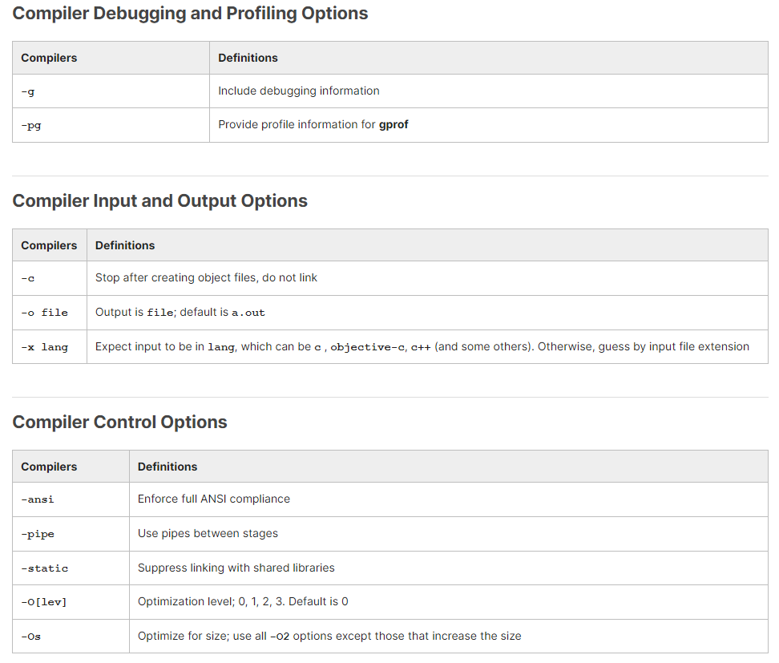

## Chapter 8. Compiling, Linking and Libraries

- Explain the use of the gcc compiler and related programs, identifying the various stages.
- Identify alternative compilers.
- Know the main options used in different stages.
- Understand the use of static libraries.
- Understand the use of shared libraries and how to find them at runtime.
- Know how to link programs to the right libraries at the compilation stage.
- Get debug information from the executables.​

## Compiling, Linking and Libraries

### gcc

**gcc** is the GNU Compiler Collection (GNU C) compiler. It can be invoked as gcc or cc, and can compile programs written in C, C++ and Objective C.

g++ is the C++ compiler (it can also be invoked as c++).

gcc works closely with the GNU libc, glibc, and the debugger, gdb.

Virtually every operating system you can think of has a version of gcc, and it can be used for cross-compilation on different architectures.

gcc also forms the backend for compiler frontends in Ada95 (package **gcc-gnat**), Fortran (package **gcc-gfortran**), and Pascal (package **gcc-gpc**). For instance, first, there is a translation to the C language, and then a backend (silently) invokes gcc. The **gcc-java** package supplies gcj, which adds support for compiling Java programs and byte code into native code, but is no longer available on most recent Linux distributions, as it is considered obsolete.

Abundant documentation can be found at GNU C's website including a [complete manual, FAQ, and platform specific information](http://gcc.gnu.org/). In addition, doing **info gcc** will give very detailed online documentation.

Invoking gcc actually entails a number of different programs or stages, each of which has its own man page, and can be independently and directly invoked.

Depending on your Linux distribution, details about the gcc installation and defaults can be found in the **/usr/lib/gcc**, **/usr/lib64/gcc** and/or **/usr/libexec/gcc** directories.

### Other Compilers

LLVMLinux
The [LLVMLinux](https://clangbuiltlinux.github.io/) project provides a new alternative compiler, meant to be used for both user applications and the Linux kernel. It has reaching maturation for compiling the Linux kernel (which is rather idiosyncratic in its use of specialized gcc options)  on most architectures, and is often used in production code for applications.

Intel
It has a [mature set of compilers](https://software.intel.com/en-us/compilers). Evaluation copies can be downloaded for free and a [free non-commercial license](https://software.intel.com/en-us/articles/non-commercial-software-faq/) can be obtained for learning purposes. The Intel C compiler works well for compiling applications under Linux. It can be used to compile the kernel but it is not a trivial exercise and it is doubtful anyone is using it for this purpose in a production environment.

### Major gcc Options

The compiled code format will be **Executable and Linkable Format (ELF)** which makes using shared libraries easy. The older **a.out** format, while obsolete (although the name a.out survives, confusingly, as the default name for an output file), may still be used if the Linux kernel has been configured to support it.

### Major gcc Options (Continued)

A good set of options to use is: **-O2 -Wall -pedantic**.

Make sure you understand any warnings. If you take the effort to obliterate them, you might save yourself a lot of debugging. However, do not use **-pedantic** when compiling code for the Linux kernel, which uses many gcc extensions.

