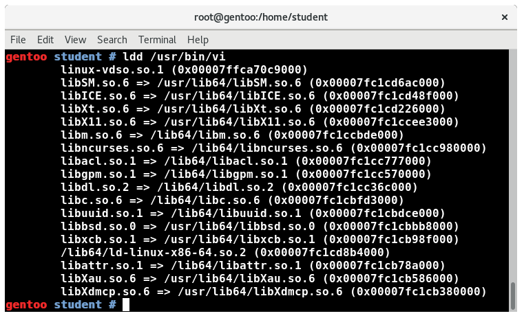

## Chapter 8. Compiling, Linking and Libraries

- Explain the use of the gcc compiler and related programs, identifying the various stages.
- Identify alternative compilers.
- Know the main options used in different stages.
- Understand the use of static libraries.
- Understand the use of shared libraries and how to find them at runtime.
- Know how to link programs to the right libraries at the compilation stage.
- Get debug information from the executables.​

## Compiling, Linking and Libraries

### gcc

**gcc** is the GNU Compiler Collection (GNU C) compiler. It can be invoked as gcc or cc, and can compile programs written in C, C++ and Objective C.

g++ is the C++ compiler (it can also be invoked as c++).

gcc works closely with the GNU libc, glibc, and the debugger, gdb.

Virtually every operating system you can think of has a version of gcc, and it can be used for cross-compilation on different architectures.

gcc also forms the backend for compiler frontends in Ada95 (package **gcc-gnat**), Fortran (package **gcc-gfortran**), and Pascal (package **gcc-gpc**). For instance, first, there is a translation to the C language, and then a backend (silently) invokes gcc. The **gcc-java** package supplies gcj, which adds support for compiling Java programs and byte code into native code, but is no longer available on most recent Linux distributions, as it is considered obsolete.

Abundant documentation can be found at GNU C's website including a [complete manual, FAQ, and platform specific information](http://gcc.gnu.org/). In addition, doing **info gcc** will give very detailed online documentation.

Invoking gcc actually entails a number of different programs or stages, each of which has its own man page, and can be independently and directly invoked.


Depending on your Linux distribution, details about the gcc installation and defaults can be found in the **/usr/lib/gcc**, **/usr/lib64/gcc** and/or **/usr/libexec/gcc** directories.

### Other Compilers

LLVMLinux
The [LLVMLinux](https://clangbuiltlinux.github.io/) project provides a new alternative compiler, meant to be used for both user applications and the Linux kernel. It has reaching maturation for compiling the Linux kernel (which is rather idiosyncratic in its use of specialized gcc options)  on most architectures, and is often used in production code for applications.

Intel
It has a [mature set of compilers](https://software.intel.com/en-us/compilers). Evaluation copies can be downloaded for free and a [free non-commercial license](https://software.intel.com/en-us/articles/non-commercial-software-faq/) can be obtained for learning purposes. The Intel C compiler works well for compiling applications under Linux. It can be used to compile the kernel but it is not a trivial exercise and it is doubtful anyone is using it for this purpose in a production environment.

### Major gcc Options

The compiled code format will be **Executable and Linkable Format (ELF)** which makes using shared libraries easy. The older **a.out** format, while obsolete (although the name a.out survives, confusingly, as the default name for an output file), may still be used if the Linux kernel has been configured to support it.


### Major gcc Options (Continued)


A good set of options to use is: **-O2 -Wall -pedantic**.

Make sure you understand any warnings. If you take the effort to obliterate them, you might save yourself a lot of debugging. However, do not use **-pedantic** when compiling code for the Linux kernel, which uses many gcc extensions.

### Static Libraries

**Static libraries** have the extension .a. When a program is compiled, full copies of any loaded library routines are incorporated as part of the executable.

The following tools are used for maintaining static libraries:
- **ar** creates, updates, lists and extracts files from the library. The command presented below will create libsubs.a if it does not exist, and insert or update any object files in the current directory: ```$ ar rv libsubs.a *.o```
- **ranlib** generates and stores within an archive an index to its contents. It lists each symbol defined by the relocatable object files in the archive. This index speeds up linking to the library. The command​ shown below is completely equivalent to running **ar -s libsubs.a**. While running **ranlib** is essential under some UNIX implementations, under Linux it is not strictly necessary, but it is a good habit to get into: ```$ ranlib libsubs.a```
- **nm** lists symbols from object files or libraries. The command below gives useful information. nm has a lot of other options: ```$ nm -s libsubs.a```

Modern applications generally prefer to use shared libraries as it is more efficient and conserves memory. However, there are at least two circumstances where static libraries are still used:
- For programs that are used early in system startup, before the tools to work with shared libraries are fully operational.
- For programs that want to be completely self-contained and not have to deal with potential problems from system updates of libraries that are utilized by the application. This is typically done by either proprietary (and even closed source) application suppliers, or by other large vendors, such as Google or Mozilla. This is always controversial, because it is up to the vendor to make sure that any security holes or other bugs are fixed when they are discovered upstream in the included libraries.

### Shared Libraries

A single copy of a **shared library** can be used by many applications at once. Thus, both executable sizes and application load time are reduced.

Shared libraries have the extension **.so**. Typically, the full name is something like **libc.so.N** where N is a major version number.

Under Linux, shared libraries are carefully versioned. For example, a shared library might have any of the following names:
- **libmyfuncs.so.1.0**
The actual shared library.
- **libmyfuncs.so.1**
The name included in the soname field of the library. Used by the executable at run-time to find the latest revision of the v.1 myfuncs library.
- **libmyfuncs.so**
Used by gcc to resolve symbol names in the library at link time when the executable is created.​​​​​
​
​To create a shared library, you must first compile all sources with the -fPIC option, which generates so-called Position Independent Code. Do not use -fpic; it produces somewhat faster code on m68k, m88k, and Sparc chips, but imposes arbitrary size limits on shared libraries.
```
$ gcc -fPIC -c func1.c
$ gcc -fPIC -c func2.c
```

To create a shared library, the option -shared must be given during compilation, giving the soname of the library as well as the full library name as the output:```$ gcc -fPIC -shared -Wl,-soname=libmyfuncs.so.1 *.o -o libmyfuncs.so.1.0 -lc```

where the **-Wl** tells gcc to pass the option to the linker. The -lc tells the linker that libc is also needed which is generally the case.

You can usually get away ignoring the **-fPIC** and **-Wl,soname** options, but it is not a good idea. This is because gcc normally emits such code anyway. In fact, giving the option prevents the compiler from ever issuing position-dependent code.

Note that it is really the linker (ld) that is doing the work, and the previously mentioned step could also have been written as: ```$ ld -shared -soname=libmyfuncs.so.1 *.o -o libmyfuncs.so.1.0 -lc```

To get the above to link and run properly, you will also have to do:
```
$ ln -s libmyfuncs.so.1.0 libmyfuncs.so
$ ln -s libmyfuncs.so.1.0 libmyfuncs.so.1
```

If you leave out the first symbolic link, you will not be able to compile the program. If you leave out the second, you will not be able to run it. It is at this point the version check is done, and if you do not use the **-soname** option when compiling the library, no such check will be done.

In many cases, both a shared and a static version of the same library may exist on the system, and the linker will choose the shared version by default. This may be overridden with the **-static** option to the linker. However, if you do this, all libraries will be linked in statically, including libc, so the resulting executable will be large; you have to be more careful than that.

The GNU libtool script can assist in providing shared library support, helping with compiling and linking libraries and executables, and is particularly useful for distributing applications and packages. Full documentation can be obtained by doing **info libtool**.

### Finding Shared Libraries

A program which uses shared libraries has to be able to find them at runtime.

**ldd** can be used to ascertain what shared libraries an executable requires. It shows the **soname** of the library and what file it actually points to.

**ldconfig** is generally run at boot time (but can be run anytime), and uses the file **/etc/ld.so.conf**, which lists the directories that will be searched for shared libraries. **ldconfig** must be run as root and shared libraries should only be stored in system directories when they are stable and useful.



Besides searching the data base built up by **ldconfig**, the linker will first search any directories specified in the environment variable **LD_LIBRARY_PATH**, a colon separated list of directories, as in the PATH variable.

So, you can do:
```
$ LD_LIBRARY_PATH=$HOME/foo/lib
$ foo [args]

or

$ LD_LIBRARY_PATH=$HOME/foo/lib foo [args]
```

### Linking to Libraries

Whether a library is static or fixed, executables are linked to the library with: ```$ gcc -o foo foo.c -L/mypath/lib -lfoolib```

This will link in **/mypath/lib/libfoolib.so** if it exists, and in **/mypath/lib/libfoolib.a** otherwise.

The name convention is such that -lwhat refers to library libwhat.so(.a). If both libwhat.so and libwhat.a exist, the shared library will be used, unless -static is used on the compile line.

Poorly designed projects may have circular library dependencies, and since the loader makes only one pass through the libraries requested, you can have something like:```$ gcc .... -lA -lB -lA ..```

if libB refers to a symbol in libA which is not otherwise referred to. While there is an option to make the loader do multiple passes (see **info gcc** for details) it is very slow, and a proper, layered library architecture should avoid this kind of going in circles.

The default library search path will always include **/usr/lib** and **/lib**. To see exactly what is being searched you can do **gcc --print-search-dirs**. User-specified library paths come before the default ones, although there are extended options to gcc to reverse this pattern.

### Stripping Executables

The command: ```$ strip foobar```

where foobar is an executable program, object file, or library archive, can be used to reduce file size and save disk space. The symbol table is discarded. This step is generally done on production versions.

Note: Do not use strip on either the Linux kernel or kernel modules, both of which need the symbol information!

### Getting Debug Information

You can use the environment variable LD_DEBUG to obtain useful debugging information.

For instance, doing:

```
​$ LD_DEBUG=help

and then typing any command, gives:

 Valid options for the LD_DEBUG environment variable are:
  libs        display library search paths
  reloc       display relocation processing
  files       display progress for input file
  symbols     display symbol table processing
  bindings    display information about symbol binding
  versions    display version dependencies
  scopes      display scope information
  all         all previous options combined
  statistics  display relocation statistics
  unused      determined unused DSOs
  help        display this help message and exit
```

### Debugging with gdb

**gdb** is the GNU debugger. Upon launch, after processing all command line arguments and options, it loads commands from the file **.gdbinit** in the current working directory (if it exists).

gdb allows you to step through C and C++ programs, setting breakpoints, displaying variables, etc. Actually it will work with programs in native Fortran and other languages that use gcc as a back end as well. In addition, gdb can properly debug multi-threaded programs.

Programs have to be compiled with the **-g** option for symbol and line number information to be available to gdb. Note, however, you can still use gdb to get some information even if this has not been done. For instance, the **where** command often tells you exactly where the program bombed.

There are a number of graphical interfaces to gdb which may make it easier to use. We will mention only:
- Larger integrated development environments (IDEs) such as [Eclipse](https://www.eclipse.org/) are often used as a graphical debugging interface.
- [DDD](https://www.gnu.org/software/ddd/) may be offered as a standard package by your distribution. While it does not provide a complete integrated development environment (IDE), it can easily provide most of the ingredients for building your own.
However, using a heavier and well-supported complete IDE (such as Eclipse) is now often preferred.

No matter what graphical interface you use, the debugger remains gdb.

### Lab 8.1. Shared Libraries

To see what shared libraries vim uses do:```$ ldd /usr/bin/vim```

This will show you the full shared library names and their locations on the filesystem.

You can gain further information about the actual shared memory segments used by starting up an instance of **vim** and making sure you know the **pid** of the process, such as by doing:

```
$ vim &
[1] 25716
```
which says the pid is 25716. You can gain this detailed information by doing either:

```
$ cat /proc/pid/maps (i.e., cat /proc/25716/maps)
or
$ pmap -d 2 pid (i.e., pmap -d 25716)
```

While there are probably separate executables for **vi** and **vim** on your system (/bin/vi and /usr/bin/vim) you probably have a default **alias** in your command shell that invokes **vim** when you type vi, so to get vi directly you have to give the full path name. Try doing the above for /bin/vi as well.

