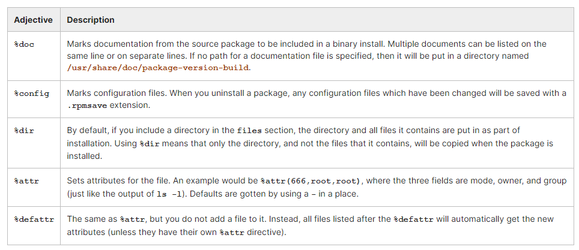
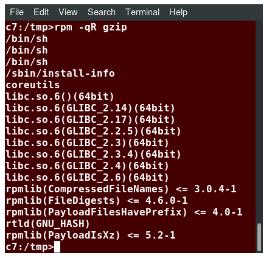
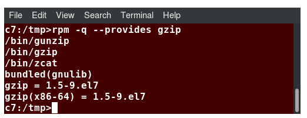

## Chapter 9. Building RPM and Debian Packages

Earlier, we discussed packaging systems, such as RPM and Debian, with the focus on uses such as installation and updating.

Developers often need to distribute their work in package form, and in this section, we will discuss how that is done for both main packaging systems.

- Understand (from the developer perspective) why package management systems are so useful.
- Know the differences and commonalities between the **rpm** and **apt** (Debian) methods.​
- Create **rpm** packages using **rpmbuild**.
- Have a detailed understanding of the sections of the **.spec** file for **rpm**.
- Build Debian packages.

## Building RPM and Debian Packages

### Why Use Package Management?

Once upon a time, most Linux distributions were simply collections of tarballs, of either binaries or sources which required compilation. Some distributions (notably Slackware) still work this way. However, this method has many disadvantages:

- Removing all files from a package can be difficult.
- One might accidentally delete a package that other packages need, or install a package that will not work because it needs other packages that have not been installed.
- A developer may lose track of what exact sources were used to build a particular binary package.
- Updates and upgrades can be very difficult, for a number of reasons:
    - Files which are no longer needed may remain on the system.
    - In-place upgrades done while the system is running may cause difficulties, even system crashes.
    - The order of upgrading software packages may be important, but not be explicitly considered.
    - Software groups that require simultaneous updating may conflict with each other.

### RPM, APT and alien

Several systems have been developed in the attempt to improve this process. As noted in earlier sections, the most widely used are RPM, APT and alien.

- **Red Hat Package Manager (RPM)**
Originally only used by Red Hat, it became popular on other Linux distributions, such as Fedora, and particularly SUSE and its derivatives, such as OpenSUSE.
- **Advanced Packaging Tool (APT)**
It produces deb packages. Originally developed by Debian, it is the foundation of Ubuntu and other Debian-derived distributions, such as Linux Mint.
- **alien**
It is a tool for converting back and forth between **rpm** and **deb** packages, or installing one kind of package on a system set up for the other. However, alien is not available on all Linux distributions.

In this section, we will not discuss how to use packaging systems for administration and security, or their ability to obtain updates through the Internet, etc. We have already discussed that in earlier sessions.

​Instead, we are going to concentrate on how to prepare packages for distribution, rather than how to install, remove, update, etc. We will also not discuss how to construct package repositories.

### Packaging System Benefits

Packaging system benefits for developers, system administrators and end users are covered next.

Benefits for Developers
- Repeatable builds.
- Generation of dependency data, such as what other packages are needed by a given package, and/or what other packages (or class of packages) may need a given package.
- Inclusion of the pristine sources, which aids in configuration control and establishing a clear history of revision.
- Full explanation of any patches that have been made to the upstream sources, together with instructions for how to proceed in building the package, as well as in installing it.

Benefits for System Administrators and End Users
- The operating system no longer has to be structured according to fixed notions of what is the core and what is an add-on. For instance, /usr/local can be reserved for software not maintained in the packaging system.
- Integrity of the installation can be verified in a uniform and rapid fashion.
- Simple installation and removal methods.
- Package updates and upgrades automatically preserve customized and modified configuration files.
- Error-checking on install and remove (erase) ensures needed resources are not obliterated.
- Users and administrators can do queries on matters including identifying what files are part of a package, or the inverse process of asking what package (if any) a given file is part of.

### Linux Distributions and Package Management

Maintenance of software by using packaging systems is an essential task of any Linux distribution. Every other function that must be accomplished requires coherent packaging. This includes:

- Keeping a healthy bi-directional connection to the upstream developers, both incorporating patches from upstream, as well as sending patches to the upstream maintainers.
- Establishing and deploying clear policies for dealing with configuration files, etc., as packages are updated.
- Updating and upgrading packages in timely fashion, both to fix outstanding bugs and security holes, and to incorporate new features.
- Most importantly, perhaps, ensuring proper package dependencies, including controlling the order of installation and removal, requiring various packages to be dealt with as one group, etc.
- Maintaining (multiple) repositories, ensuring that they are secure and authoritative, as well as complete.

Linux distributions include software from many sources. Maintaining coherence, ensuring proper licensing compliance, etc., is actually a very difficult task.

The package maintainer may be an employee of the distribution (especially for commercial distributions such as Red Hat or Ubuntu) or a "volunteer" for other distributions such as Debian or Fedora.

In either case, the maintainer has to think long term, how to really do a good job on the package building so that updates, upgrades, and use of different systems, can be done rather cleanly with time.

In this course, we are not really going to view building packages from the package maintainer's perspective, which requires a level of sophistication and complication beyond what can be taught in a short period of time. Here, we will concentrate on the rather simpler task of how an application developer can package up their application using RPM or Debian packaging. We are not considering more involved scenarios, such as libraries or suites of related applications.

### RPM Creation: rpm and rpmbuild

The RPM packaging system separates its main functionality methods using these two main programs:
- **rpm**
Handles querying, installing, upgrading, and erasing.
- **rpmbuild**
Handles creating and manipulating source and binary packages.

​Each of these programs comes packaged as part of its own rpm and comes together with other related utilities, which we will not discuss in this section.

```
$ rpm -qil rpm-build | grep bin

/usr/bin/gendiff
/usr/bin/rpmbuild
/usr/bin/rpmspec

$ rpm -qil rpm | grep bin

/bin/rpm
/usr/bin/rpm2cpio
/usr/bin/rpmdb
/usr/bin/rpmkeys
/usr/bin/rpmquery
/usr/bin/rpmverify
```

It is a rather obvious point, but you should never remove the rpm program itself!

### RPM Creation: Ingredients

There are three basic ingredients required to assemble the source and binary packages:

- A **tarball** file containing all source code, makefiles, default configuration files, documentation, etc.
- Any **patch files** needed to be applied to the upstream source encapsulated in the tarball.
- A **spec file** that must be written that describes the package and how to patch and build it, dependency information, etc.

Once you have all these files together, the command: ```$ rpmbuild -ba specFile```
will perform the following steps:
- Coalesce the input files into the source RPM
- Unpack the source tar file
- Apply all patch files
- Build binaries for the current architecture
- Package binaries and configuration files into a binary RPM file.

Each of these steps is described by the spec file that the packager wrote.


### Inputs and Outputs of RPM

​RPM can be picky about where these files are placed. We will return to this question in the lab exercise.


If you want binaries for multiple platforms, then once you have the source RPM you can just copy it to a machine of another architecture and run **rpmbuild --rebuild SourceRPM** (or you can do a cross-compile if you have the cross-compile toolchain installed). This command can also be used to re-create the binary RPM from the source RPM in case you ever need to do so.

Also note that some "binary" rpms contain no binary files, i.e. they contain only scripts, configuration files, etc., that work independently of architecture. They will have the string noarch in their binary package name rather than i686 or x86_64, etc.

### The RPM spec File

A **spec** file is a collection of package information and shell scripts. Many of of the shell scripts are very short (one line scripts are common). Each script performs one of the tasks necessary in building, installing, or uninstalling a package.

The main sections of the file can be seen in the table below.


### RPM spec Sections: header

The **header** section is a list of assignments. Below you will find its format:
Attribute: Value

You can see an example showing the attributes that are usually used:
```
Summary: A great application!
Name: my_app
Version: 1.0
​Release: 2
License: GPLv2
Group: Applications/Text
Source: ftp://ftp.myserver.com/pub/my_app/my_app-1.0.tgz
URL: http://www.myserver.com/my_app...
Vendor:  The Best Software Company
Packager: A genius <genius@myserver.com>
Patch0: my_app-1.0.patch0
Patch1: my_app-1.0.patch1
BuildRoot: /var/tmp/%{name}-buildroot
```

The **Name, Version, and Release** values are used to construct the names of the source and binary RPM files. Most other values are fairly self-explanatory, and can be chosen at will by the packager.

Note: The License field was called Copyright in earlier versions of rpm

### RPM spec Sections: description

The **description** section has a completely free form. To see the description of an existing package, try:```rpm -qi package```

An example of description can be seen below:
```
%description
This program enables the user to do everything that could 
possibly be useful under Linux.
```

### RPM spec Sections: prep

The **prep** section is in the header, and must take the tar file of the source code, unpack it, and then apply any patch files needed. Often, this section is extremely short.

An example of a prep section would be:
```
%prep
rm -rf $RPM_BUILD_DIR/my_app-1.0
tar xvf $RPM_SOURCE_DIR/my_app-1.0.tar.gz
patch -p1 < my_app-1.0.patch1
patch -p2 < my_app-1.0.patch2
```

Modern versions of rpmbuild do not use such detailed prep sections.

They can simply do:​
```
%prep
%setup -q
%autosetup
```

### RPM spec Sections: changelog

The **changelog** section lists a history of changes to the package.

For example:
```
%changelog
* Tue Feb 29 2001 Mr Somebody <sbody@foo.com>
- important fix: cleaned up a bug that trashed the filesystem.

* Tue Feb 15 2001 Another Somebody <abody@foo.com>
- made minor changes to the initialization routine.
```

### RPM spec Sections: build

The **build** section contains the commands needed to build your program. If your prep section did its work correctly, this should be one command:
```
%build
make
```

### RPM spec Sections: install
​​​​​​​​The **install** section copies files to their final place in the filesystem. This is run after building the binaries, but not when the package is installed. When the binary is built, **RPM** will automatically package up the files that were put in place by the **install** section, then, during installation, it will copy them back.

Usually, developers put an install target into makefiles that do this copying, which makes the **install** section of the **spec** file simple:
```
%install
make install
```

### RPM spec Sections: files

The **files** section lists all of the files that the **install** section copied into place. Files may be prefixed by an adjective that changes how **RPM** treats these files.

The possible adjectives are listed in the table below.


An example files section would be:
```
%files
%doc README
/usr/bin/my_app
%config /usr/bin/my_app_configure
/usr/man/man/my_app.1
%attr(600,-,root) /usr/lib/my_app/my_data
```

### RPM Dependencies

In the **spec** file, you may specify three types of dependency information:
- ​Capabilities that this package provides
- Capabilities that this package requires
- Packages that this package requires.
A capability is a required function or class of functions.

You can see what libraries a package requires with ```$ rpm -qR package```

as presented in the screenshot:


You can also see what libraries a package provides as in the following screenshot:```$ rpm -q --provides gzip```



The names you see as the capabilities is not the full path name of the library; instead it is what is called the soname of the library.

Any dynamic libraries in the files section of the spec are automatically added as capabilities that the package provides. In addition, RPM will automatically run scripts (called **find-requires** and **find-provides**) that determine which dynamic libraries your binary requires, so these will automatically be added to the list of capabilities that your package requires.

If your package has other requirements besides dynamic libraries, you can specify that another package must be installed by putting code of this format in the header section of your spec file:
```
requires: package
requires: package >= version
requires: package >= version-build
```

In addition to the >= test (which requires that a package of the version specified or later is installed), you can also use >, =, <, and <=.

### Demo: Building a Binary RPM Package
TODO

### Debian Package Creation Workflow

Building a Debian package requires many more files than does the RPM system, where almost all the complications go into the **spec** file.

The most authoritative documentation is provided in the [Debian New Maintainers' Guide](https://www.debian.org/doc/manuals/maint-guide/).

At a first glance, it is almost frighteningly complicated. However, there exist auxiliary utilities, such as **debuild** and **cdbs**, which can automate many tasks, provide templates for files which do not often have to be complex, and give command line interfaces for updating the various configuration files.

We will begin by explaining the basic package building workflow:

- First, you will need the upstream package source, provided as a tarball in the form: **package-version.tar.gz** such as **someprogram-1.0.tar.gz**. Note the use of the hyphen **(-)** between the package name and the version number. The system is very picky about the name; it must contain only lower case letters, digits, plus and minus signs, and periods. It cannot contain dashes or underscores.
- You will also need any patches that need to be made to the upstream source.
- The source will be expanded into **someprogram-1.0** and the original source tar ball will be preserved in
- **package_version.orig.tar.gz**. Note the use of the underscore (_), which has replaced the hyphen in the name; this can be very confusing!
- A directory **someprogram-1.0/debian** is created, and will be filled with all the files needed by the package building system.
- Source and binary packages are built from these ingredients. The binary package has the **.deb** suffix. We will talk about what a source package looks like later in an exercise. Unlike RPM, where the source package is just one file, Debian source packages contain several files.

## Lab Exercises

### Lab 9.1. Building RPMs

On **RedHat or SUSE based Systems**: If you are on an RPM packaging system you should do this exercise. If you are on an APT packaging system, you should do Lab 9.2.

- We give you the source files for a trivial **Hello world** application, in the directory **my_app_1.0.0**.
- We also give you a slightly modified version of the source in **my_app_1.0.0_PATCHED**.

**Please Note: The source directory includes a README file; without it, some versions of RPM will bail out in error; it is always good practice to have one anyway.**

Construct the patch file, i.e., by doing something like:```$ diff -Nur my_app_1.0.0 my_app_1.0.0_PATCHED > my_app-1.0.0.patch```

Write a **spec** file.

Construct source and binary **RPM’s** using **rpmbuild**.

Install and test the binary rpm by doing:
```
$ sudo rpm -ivh $HOME/rpmbuild/my_app-1.0.0.x86_64.rpm
/usr/local/binmyhello
```

And then remove it with: ```$ sudo rpm -e my_app```

Also try rebuilding from the source package: ```$ rpmbuild --rebuild $HOME/rpmbuild/SRPMS/my_app-1.0.0-1.src.rpm```
And test as before.

The script build_rpm.sh demonstrates one possible way to do the procedure.

Solution 9.1.1
```
#!/bin/bash

RROOT=$HOME/rpmbuild
PATCHFILE=my_app-1.0.0.patch

# just for in testing: # rm -rf $RROOT

for names in SOURCES SPECS BUILD RPMS SRPMS ; do
    [[ ! -d $RROOT/$names ]] && mkdir -p $RROOT/$names
done
# construct patch file
diff -Naur my_app-1.0.0 my_app-1.0.0_PATCHED > $PATCHFILE
# produce unpatched source tar ball
tar zcvf $RROOT/SOURCES/my_app-1.0.0.tar.gz my_app-1.0.0

# copy specfile and tar ball to the rpmbuild directories
cp $PATCHFILE $RROOT/SOURCES/
cp my_app-1.0.0.spec $RROOT/SPECS
cd $RROOT/SPECS
# ok construct binary and source rpms!
rpmbuild -ba my_app-1.0.0.spec
```
You can download a script with the above steps from s_09/build_rpm.sh. 

Solution 9.1.2:
```
CFLAGS :=       -O $(CFLAGS)
TARGET=         myhello
SRCFILES=       myhello.c

all: $(TARGET)

$(TARGET):      $(SRCFILES)
        $(CC) $(CFLAGS) -o $(TARGET) $(SRCFILES)

clean:
        rm -f $(TARGET)
```

You can download a script with the above steps from s_09/my_app-1.0.0 or s_09/my_app-1.0.0_PATCHED. 

Solution 9.1.3:
```
#!/bin/bash

echo Run ./build_rpm.sh to get the sample solution for the RPM lab
echo "    OR ..."     
echo Run ./lab_makedeb.sh to get the sample solution for the DEB lab
```
You can download a script with the above steps from s_09/nomake.sh.

### Lab 9.2. Building a Debian Package from Source

On **Debian-based Systems**: If you are on an APT packaging system, you should do this exercise. You should do the previous lab if you are on an RPM packaging system.

In this exercise, we will build a Debian package from its upstream source tarball. (Of course, if you are on a non-Debian-based system, you can not perform this exercise!)

We will use a simple hello program package, the source of which is contained in the SOLUTIONS tarball you can obtain from here.

Before beginning, you may want to make sure you have the necessary utilities installed with:
```$ sudo apt-get install dh-make fakeroot build-essential```

The contents are:
```
$ tar xvf myappdebian-1.0.tar.gz
myappdebian-1.0/
myappdebian-1.0/Makefile
myappdebian-1.0/myhello.c
myappdebian-1.0/README
```
Where:

```
$ cat README
Some very informative information should go in here :)
```

```
$ cat myhello.c

1 #include <stdio.h>
2 #include <stdlib.h>
3 char hello_string[] = "hello world";
4 int main ()
5 {
6         printf ("\n%s\n\n", hello_string);
7         exit (EXIT_SUCCESS);
8 }
```

```
$ cat Makefile

BIN = $(DESTDIR)/usr/bin 
CFLAGS :=       -O $(CFLAGS) 
TARGET=         myhello
SRCFILES=       myhello.c 

all: $(TARGET) 

$(TARGET):      $(SRCFILES)  
$(CC) $(CFLAGS) -o $(TARGET) $(SRCFILES) 

install: $(TARGET)  
install -d $(BIN) 
install $(TARGET) $(BIN) 

clean: 
rm -f $(TARGET)
```

You can certainly construct a simpler Makefile. However, you must have the line:```BIN = $(DESTDIR)/usr/bin```

and point the installation to the BIN directory, or the executable will not be installed as part of the package.

1. Make a working directory and put a copy of the source tarball in there:
```
$ rm -rf WORK && mkdir WORK && cd WORK
$ cp ../myappdebian-1.0.tar.gz .
```
2. Expand the source tarball:
```$ tar xvf myappdebian-1.0.tar.gz```

3. Go into the expanded directory and build the package using dh_make, one of several possible package builder programs:
```
$ cd myappdebian-1.0
$ dh_make -f ../*myappdebian-1.0.tar.gz
$ dpkg-buildpackage -uc -us
```

4. Make sure the program works!
```
$ ./myhello
hello world
Verify its contents:
$ dpkg --contents ../*.deb
```

5. Take a good look at all the files in the debian directory and try to imagine building them all by hand!

6. Install the package:
```
$ cd ..
$ sudo dpkg --install *.deb
Verify the installation worked:
$ myhello
hello world
You can uninstall the package with:
$ sudo dpkg --remove myappdebian
```

Solution 9.2:

```
#!/bin/bash -x

# clean up from any previous attempts
rm -rf WORK && mkdir WORK && cd WORK

# need a copy of the tarball in the WORK directory
cp ../myappdebian-1.0.tar.gz .

# expand the upstream tarball source
tar xvf myappdebian-1.0.tar.gz

# build the package
cd myappdebian-1.0
dh_make -f ../*myappdebian-1.0.tar.gz
dpkg-buildpackage -uc -us
# check its contents
dpkg --contents ../*.deb

echo you should be able to install now with dpkg --install
```

You can download a script with the above steps from s_09/lab_makedeb.sh.
