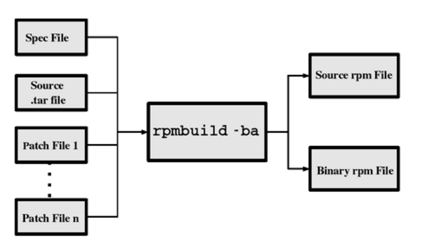
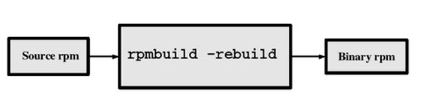
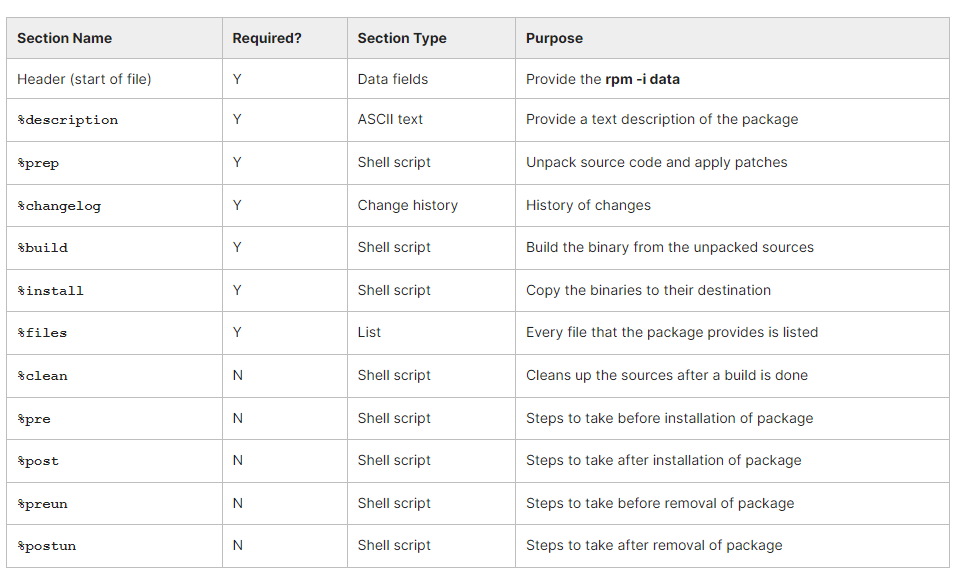

## Chapter 9. Building RPM and Debian Packages

Earlier, we discussed packaging systems, such as RPM and Debian, with the focus on uses such as installation and updating.

Developers often need to distribute their work in package form, and in this section, we will discuss how that is done for both main packaging systems.

- Understand (from the developer perspective) why package management systems are so useful.
- Know the differences and commonalities between the **rpm** and **apt** (Debian) methods.​
- Create **rpm** packages using **rpmbuild**.
- Have a detailed understanding of the sections of the **.spec** file for **rpm**.
- Build Debian packages.

## Building RPM and Debian Packages

### Why Use Package Management?

Once upon a time, most Linux distributions were simply collections of tarballs, of either binaries or sources which required compilation. Some distributions (notably Slackware) still work this way. However, this method has many disadvantages:

- Removing all files from a package can be difficult.
- One might accidentally delete a package that other packages need, or install a package that will not work because it needs other packages that have not been installed.
- A developer may lose track of what exact sources were used to build a particular binary package.
- Updates and upgrades can be very difficult, for a number of reasons:
    - Files which are no longer needed may remain on the system.
    - In-place upgrades done while the system is running may cause difficulties, even system crashes.
    - The order of upgrading software packages may be important, but not be explicitly considered.
    - Software groups that require simultaneous updating may conflict with each other.

### RPM, APT and alien

Several systems have been developed in the attempt to improve this process. As noted in earlier sections, the most widely used are RPM, APT and alien.

- **Red Hat Package Manager (RPM)**
Originally only used by Red Hat, it became popular on other Linux distributions, such as Fedora, and particularly SUSE and its derivatives, such as OpenSUSE.
- **Advanced Packaging Tool (APT)**
It produces deb packages. Originally developed by Debian, it is the foundation of Ubuntu and other Debian-derived distributions, such as Linux Mint.
- **alien**
It is a tool for converting back and forth between **rpm** and **deb** packages, or installing one kind of package on a system set up for the other. However, alien is not available on all Linux distributions.

In this section, we will not discuss how to use packaging systems for administration and security, or their ability to obtain updates through the Internet, etc. We have already discussed that in earlier sessions.

​Instead, we are going to concentrate on how to prepare packages for distribution, rather than how to install, remove, update, etc. We will also not discuss how to construct package repositories.

### Packaging System Benefits

Packaging system benefits for developers, system administrators and end users are covered next.

Benefits for Developers
- Repeatable builds.
- Generation of dependency data, such as what other packages are needed by a given package, and/or what other packages (or class of packages) may need a given package.
- Inclusion of the pristine sources, which aids in configuration control and establishing a clear history of revision.
- Full explanation of any patches that have been made to the upstream sources, together with instructions for how to proceed in building the package, as well as in installing it.

Benefits for System Administrators and End Users
- The operating system no longer has to be structured according to fixed notions of what is the core and what is an add-on. For instance, /usr/local can be reserved for software not maintained in the packaging system.
- Integrity of the installation can be verified in a uniform and rapid fashion.
- Simple installation and removal methods.
- Package updates and upgrades automatically preserve customized and modified configuration files.
- Error-checking on install and remove (erase) ensures needed resources are not obliterated.
- Users and administrators can do queries on matters including identifying what files are part of a package, or the inverse process of asking what package (if any) a given file is part of.

### Linux Distributions and Package Management

Maintenance of software by using packaging systems is an essential task of any Linux distribution. Every other function that must be accomplished requires coherent packaging. This includes:

- Keeping a healthy bi-directional connection to the upstream developers, both incorporating patches from upstream, as well as sending patches to the upstream maintainers.
- Establishing and deploying clear policies for dealing with configuration files, etc., as packages are updated.
- Updating and upgrading packages in timely fashion, both to fix outstanding bugs and security holes, and to incorporate new features.
- Most importantly, perhaps, ensuring proper package dependencies, including controlling the order of installation and removal, requiring various packages to be dealt with as one group, etc.
- Maintaining (multiple) repositories, ensuring that they are secure and authoritative, as well as complete.

Linux distributions include software from many sources. Maintaining coherence, ensuring proper licensing compliance, etc., is actually a very difficult task.

The package maintainer may be an employee of the distribution (especially for commercial distributions such as Red Hat or Ubuntu) or a "volunteer" for other distributions such as Debian or Fedora.

In either case, the maintainer has to think long term, how to really do a good job on the package building so that updates, upgrades, and use of different systems, can be done rather cleanly with time.

In this course, we are not really going to view building packages from the package maintainer's perspective, which requires a level of sophistication and complication beyond what can be taught in a short period of time. Here, we will concentrate on the rather simpler task of how an application developer can package up their application using RPM or Debian packaging. We are not considering more involved scenarios, such as libraries or suites of related applications.

### RPM Creation: rpm and rpmbuild

The RPM packaging system separates its main functionality methods using these two main programs:
- **rpm**
Handles querying, installing, upgrading, and erasing.
- **rpmbuild**
Handles creating and manipulating source and binary packages.

​Each of these programs comes packaged as part of its own rpm and comes together with other related utilities, which we will not discuss in this section.

```
$ rpm -qil rpm-build | grep bin

/usr/bin/gendiff
/usr/bin/rpmbuild
/usr/bin/rpmspec

$ rpm -qil rpm | grep bin

/bin/rpm
/usr/bin/rpm2cpio
/usr/bin/rpmdb
/usr/bin/rpmkeys
/usr/bin/rpmquery
/usr/bin/rpmverify
```

It is a rather obvious point, but you should never remove the rpm program itself!

### RPM Creation: Ingredients

There are three basic ingredients required to assemble the source and binary packages:

- A **tarball** file containing all source code, makefiles, default configuration files, documentation, etc.
- Any **patch files** needed to be applied to the upstream source encapsulated in the tarball.
- A **spec file** that must be written that describes the package and how to patch and build it, dependency information, etc.

Once you have all these files together, the command: ```$ rpmbuild -ba specFile```
will perform the following steps:
- Coalesce the input files into the source RPM
- Unpack the source tar file
- Apply all patch files
- Build binaries for the current architecture
- Package binaries and configuration files into a binary RPM file.

Each of these steps is described by the spec file that the packager wrote.



### Inputs and Outputs of RPM

​RPM can be picky about where these files are placed. We will return to this question in the lab exercise.



If you want binaries for multiple platforms, then once you have the source RPM you can just copy it to a machine of another architecture and run **rpmbuild --rebuild SourceRPM** (or you can do a cross-compile if you have the cross-compile toolchain installed). This command can also be used to re-create the binary RPM from the source RPM in case you ever need to do so.

Also note that some "binary" rpms contain no binary files, i.e. they contain only scripts, configuration files, etc., that work independently of architecture. They will have the string noarch in their binary package name rather than i686 or x86_64, etc.

### The RPM spec File

A **spec** file is a collection of package information and shell scripts. Many of of the shell scripts are very short (one line scripts are common). Each script performs one of the tasks necessary in building, installing, or uninstalling a package.

The main sections of the file can be seen in the table below.



